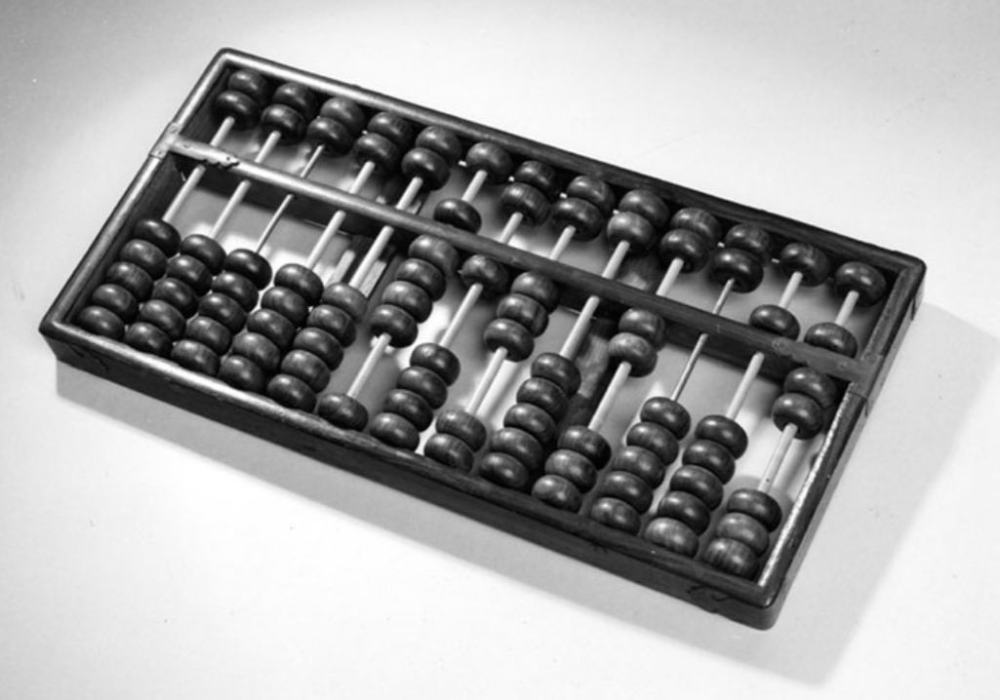
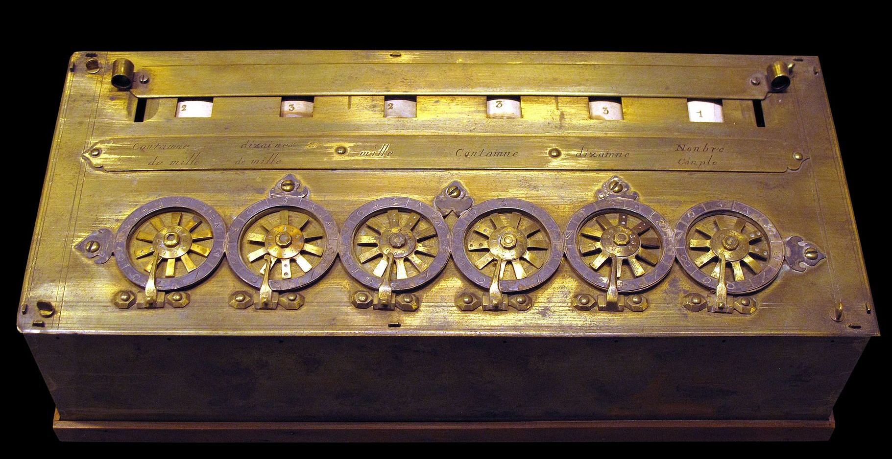
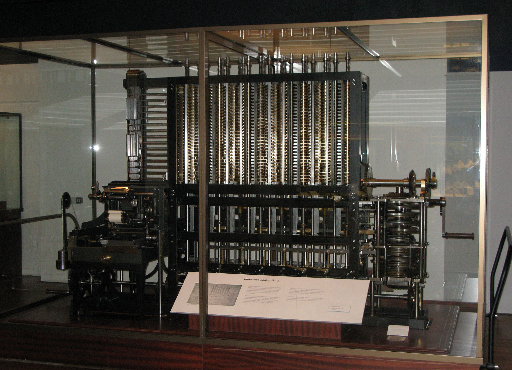
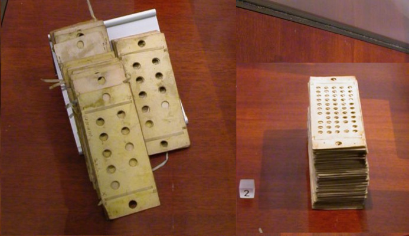
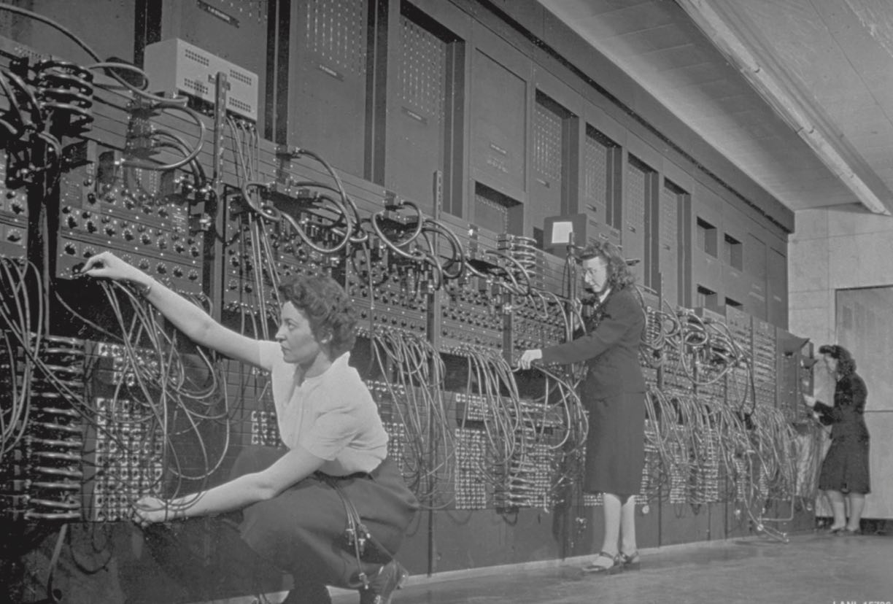
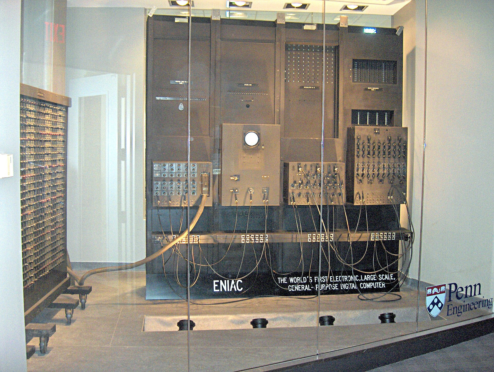
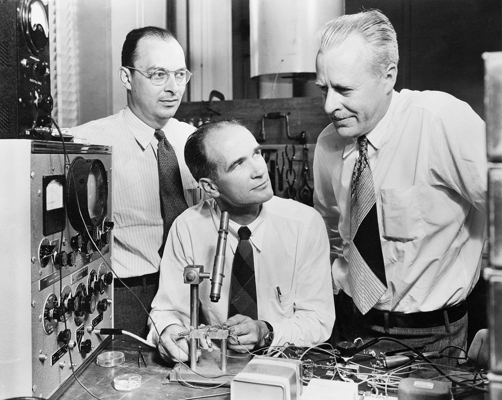

# Лекция 0.  Алгоритмы, задачи, вычислительные машины.

## Часть 2 - Вычислительные машины

Создание алгоритма для решения некоторой вычислительной задачи - важная работа. Как только правильный (с точки зрения выдаваемых результатов) и эффективный (с точки зрения затрачиваемых ресурсов) алгоритм придуман, решение рассматриваемой задачи больше не требует понимания принципов, на которых построен алгоритм. Далее все сводится лишь к последовательному исполнению шагов алгоритма.

Большая часть вычислительных задач из реальной жизни требует множества вычислений над большими объемами данных. Выполнение даже самого оптимального алгоритма человеком в таком случае совсем не выглядит хорошей идеей.

Чтобы быстро выполнять уже имеющиеся эффективные алгоритмы, люди в течение нескольких столетий изобретали и улучшали **вычислительные машины**.

### Ранние механические машины

**Abacus (Счёты)**
Одно из самых ранних устройств для выполнения арифметических операций. В большей степени являлось средством хранения и представления чисел, сам процесс вычислений проводился человеком.

**Изображение 0.2.0 - Abacus**

**Источник: Computer science: an overview**

После средних веков многие ученые и изобретатели начали предпринимать попытки создания более сложных вычислительных машин. 

Первое запатентованное и функционирующее счетное устройство - механический калькулятор, созданный в 1640х годах Блезом Паскалем.
Состояло из спиц и колёсиков, умело складывать и вычитать.

Несколько десятилетий спустя математик Готфрид Лейбниц попытался усовершенствовать калькулятор Паскаля, но не смог воплотить свои идеи, из-за отсутствия талантливых инжеренов в своем окружении.

**Изображение 0.2.1 - Калькулятор Паскаля**

**Источник: https://en.wikipedia.org/wiki/Pascal's_calculator**

Вычислительные машины этого периода полагались на механические элементы, входные данные задавались как начальные положения шестерёнок/валиков/барабанов и т.д. Выходные данные считывались как конечные положения механических элементов или даже печатались на бумаге.

Из операций данные машины поддерживали в основном арифметические действия. Однако, участие оператора уже существенно снизилось - все действия производились механизмами внутри машин.

### Чарльз Бэббидж и Ада Байрон (Лавлейс)

Позже английский математик и инженер Чарльз Бэббидж (1791 - 1871) создал **разностную машину (differential engine)**, способную вычислять синусы, косинусы, тангенсы и логарифмы. Вычисление этих функций разбивалось на элементарные арфиметические операции.

Механизм расностной машины состоял из валиков с дисками. Валики поворачивались и каждый угол соответствовал цифре.

**Изображение 0.2.2 - Разностная машина Бэббиджа (Differential engine)**

**Источник: https://en.wikipedia.org/wiki/Difference_engine**

Новая идея возникла у Бэббиджа в 1834 году. Он разработал проект счётной машины общего назначения, которая могла выполнять множество операций по инструкциям, задаваемых ей программным образом. В машине предполоагалось использование перфокарт - бумажных модулей с отверстиями (идея была позаимствована у ткацкого станка Жаккарда). Это изобретение Чарльз Бэббидж назвал **аналитической машиной (analytical engine)**. В аналитической машине были собраны все инновации из других областей того времени.

**Изображение 0.2.3 - Карты с инструкциями и данными для Analytical Engine**

**Источник: https://en.wikipedia.org/wiki/Analytical_engine**

Пытаясь найти финансирование для своей машины Бэббидж выступил на съезде учёных в Турине, где молодой военный инженер Луиджи Менабреа законспектировал его доклад, а в дальнейшем опубликовал подробное описание аналитической машины на французском языке.

Ада Лавлейс перевела эту статью на английский для публикации в Scientific Memoirs. Чарльз Бэббидж был удивлён тем, как она разобралась в материале и предложил ей сделать примечания к переводу.

Ада Лавлейс подробно и описала алгоритм генерации ряда Бернулли на аналитической машине Бэббиджа. Позже она создала таблицу и диаграмму (включавших список команд, регистры), показывавших как алгоритм будет передаваться в компьютер. Примечания Ады Лавлейс по объему вдвое привысили оригинальную статью, эта работа стала первой опубликованной компьютерной программой. Таким образом,  а Ада Лавлейс вошла в историю как первый программист.

Помимо первой задокументированной программы Ада Лавлейс предложила несколько концепций, которые на многие годы опередили развитие вычислительное техники:
- **Машина общего назначения**, может быть запрограммирована для выполнения бесконечного числа и неограниченного круга задач
- Функции машины не должны быть ограничены математикой и числами (например, работа со словами и символами)
- Идея **подпрограмм**
- **Искуственный интеллект**. "Аналитическая машина не претендует на создание чего-то своего. Она может выполнить любую команду, которую мы сумеем задать. ... но от нее нельзя ожидать вывода каких-либо аналитических соотношений или законов"

### Электронные вычислительные машины
Технологии 19 века не позволяли создать многие из вышеперечисленных вариантов вычислительных машин относительно дешево. Но, с развитием электроники в первой половине 20 века эта проблема была решена.

Повсеместно, во всем мире стали появляться более совершенные вычислительные электро-механические устройства.

**Машина Роберта Штиблица** из Bell Labs ("Модель К", 1940 год) - электромеханические реле, не была полностью электронной. Не была универсальной, программируемой, предназначалась для определенной задачи.

**Машина Германа Цузе** (Z3, май 1941 года) - первая автоматически контролируемое, программируемое электрическое двоичное устройство. Но не была полностью электронной, также были переключатели - щёлкающие реле. Не пошла в производство, была разрушена после бомбардировок Берлина в 1943.

**Компьютер Джона Винсента Атанасова**. Был первым электронным компьютером в мире (использовал электронные лампы). Но блоки памяти содержали механические вращающиеся барабаны. Не был программируемым и универсальным - был создан для решения систем линейных уравнений.

**Машина Colossus I** - создана Максом Ньюманом, Томми Флауэрсом и Аланом Тьюрингом. Электронный, программируемый и работающий. Но не являлся компьютером общего назначения и тьюринг-полной машиной и также был узкоспециализированным - для взлома военных кодов Германии. 

**Компьютер Mark I Говарда Айкена**, построенный с участием IBM и введенный в эксплуатацию в мае 1944 года бы программируемым, но электро-механическим, а не электронным.

**ENIAC**, построенный **Джоном Мокли** и **Преспером Эккертом** в ноябре 1945 года был первой машиной, включающей все черты современного компьютера.

Он был полностью электронным (основанным на электронных лампах), сверхбыстрым и его можно было программировать с помощью отключения или подключения соответсвующих кабелей. Он мог менять программы в зависимости от промежуточных результатов и считался компьютером общего назначения и тьюринг-полной машиной, то есть теоретически мог решить любую задачу.

**Изображение 0.2.4 - ENIAC и команда женщин-программистов**

**Источник: #TODO:  вставить ссылку**

**Изображение 0.2.5 - ENIAC**

**Источник: https://en.wikipedia.org/wiki/ENIAC**

#TODO: Добавить про команду женщин-программистов

### Транзисторы

После создания ENIAC компьютеры развивались со стремительной скоростью. Электронные лампы были дорогими, громоздкими, поглощали много энергии. Для компьютеров того времени их было необходимо очень много.
Наиболее значимым в этот период являлось изобретение транзисторов, которые пришли на замену электронным лампам.
За это, команда Bell Labs в лице Уиллиама Шокли,  Джон Бардина и Уолтера Браттейна была удостоена Нобелевской премии по физике.

**Изображение 0.2.6 - Бардин, Шокли и Браттейн в лаборатории, 1948 год**

**Источник: https://en.wikipedia.org/wiki/Transistor**

Далее одновременно в двух местах - Texas Instruments (Джон Килби) и Fairchild Semiconductors (Роберт Нойс и Гордон Мур) было сделано новое изобретение. Его результатом стало появление интегральной микросхемы известной как микрочип.
Идея заключалась в помещение транзисторов и других элементов на единую кремниевую пластину. Вместо связующих их проволочек было предложено пропечатать небольшие медные линии.
Это добавило надежности и сделало производство таких схем более массовым и дешевым.

В результате, машины размером с комнату 1940-е годы были уменьшены за десятилетия до размеров одиночных шкафов. В то же время вычислительная мощность машин стала удваиваться каждые два года. По мере продвижения работы над интегральными схемами многие схемы внутри компьютера стали доступны на открытом рынке в виде интегральных схем, заключенных в пластиковые блоки размером с игрушку, называемые микросхемами.

**Изображение 0.2.7 - #TODO: Вставить картинку с микросхемой**

**Источник: #TODO: Добавить ссылку**

Количество транзисторов в современных процессорах исчисляется миллиардами.

**Изображение 0.2.8 - #TODO: Вставить картинку с процессором и его структурой (алу, память)**

**Источник: #TODO: Добавить ссылку**

## Вопросы

- **Вопрос 1.** #TODO: Добавить вопрос 1

- **Вопрос 2.** #TODO: Добавить вопрос 2
 
  
## Ссылки
#TODO: Добавить ссылки

[1] Brookshear J. G., Smith D., Brylow D. Computer science: an overview. – 2012.
[2] The Innovators: How a Group of Hackers, Geniuses, and Geeks Created the Digital Revolution Paperback – October 6, 2015, Walter Isaacson