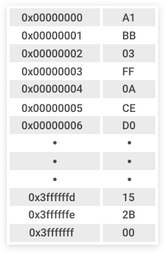
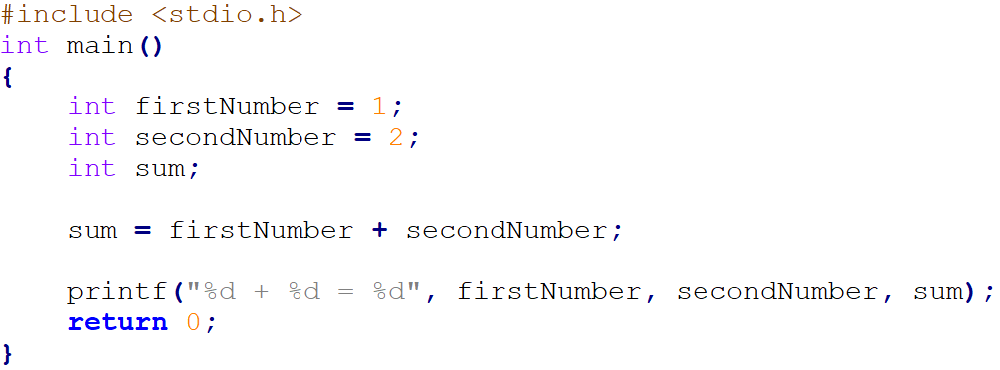
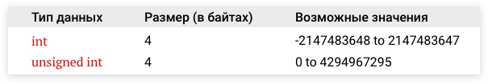
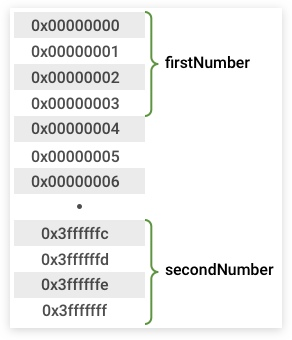
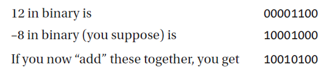
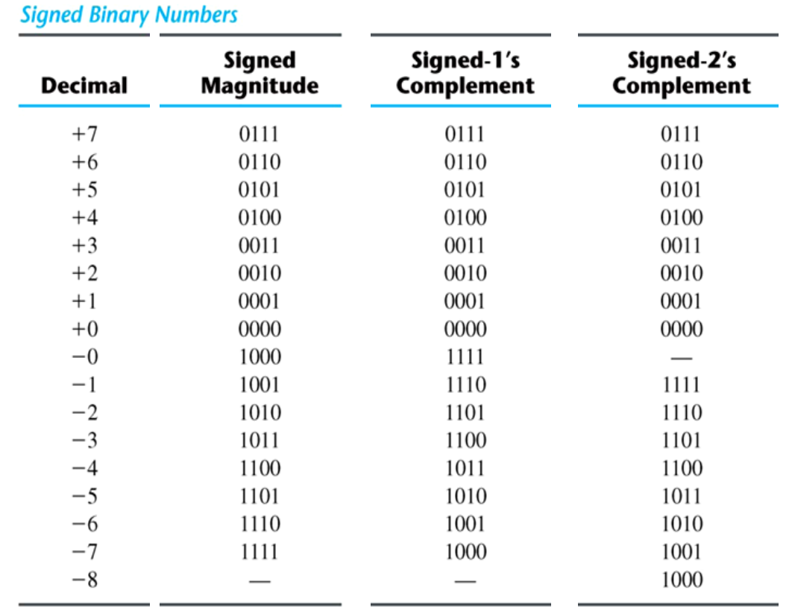
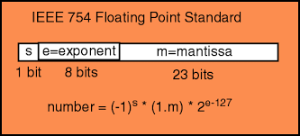
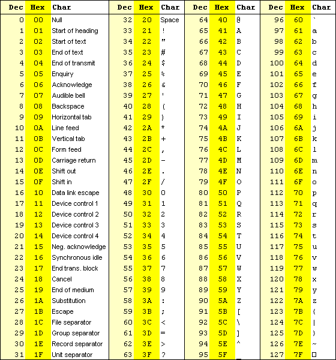

# Лекция 0.  Алгоритмы, задачи, вычислительные машины.

## Секция 4 -  Алгоритмы и данные

Любая программа состоит из алгоритма и данных. Программе необходимо уметь считывать входные данные, каким-то образом сохранять их и промежуточные результаты в памяти комьпютера и возвращать ответ.

#TODO: 1-2 предложения с картинкой про байты и биты

Память компьютера можно рассматривать как очень большую ленту из байтов.  Каждый ячейка содержит данные – значение от 0 до FF. Эти значения могут интерпретироваться по-разному в зависимости от того, данные какой природы мы ожидаем в этой памяти.

**Изображение 2. Упрощенная модели памяти**
**Источник: -----**
#TODO: Картинку про адреса, их примерное hex содержание, номер байта 

#TODO: 1-2 предложения с картинкой про машинное слово

Работа с данными осуществляется с помощью **переменных**.

**Имя переменной** – адрес ячейки памяти, по которому хранится некоторое значение. Само имя переменной обычно записывается в символьном виде, что позволяет понимать, о каких данных идет речь.

Пример простейшей программы:

**Изображение 2. Простая программа с целочисленными переменными**
**Источник: -----**

Каждой переменной обычно соответствует некоторый **тип данных** – он определяет как будет интерпретироваться информация в ячейке/ячейках переменной и какие операции с ней можно производить в программе.

**Изображение 2. Пример разного содержимого типов**
**Источник: -----**

**Изображение 2. Пример расположения в памяти**
**Источник: -----**
#TODO: Улучшить картинку, добавить decimal номера

### Типы данных

#TODO: добавить определение типа данных

**Различные категории типов данных:**

**Целые числа (int/integer)**
Беззнаковые целые числа (unsigned)
Числа со знаком (signed)

**Вещественные числа/числа с плавающей точкой (floating point):**
числа с обычной точностью (float)
числа с двойной точностью (double)

**Символы (character):**
ASCII символы (char)

#### Беззнаковые целые числа (unsigned)

Стратегия хранения беззнаковых целых чисел достаточно тривиальна – хранится само число в двоичном виде без всяких модификаций.

short c = 10 -------> 0000000000001010

#### Знаковые целые числа
В самом простом случае для представления отрицательных чисел в памяти компьютера можно использовать отдельных бит для знака (**sign bit**)

На практике знаковым битом всегда выбирается самый левый (старший) бит.

Пример: представим в 1 байте числа 6 и -6

  6  = 00000110, 
–6  = 10000110

Для изменения знака числа в данном случае надо лишь инвертировать старший (левый) бит. Для отрицательных чисел 1, для положительных 0.
Такой способ представления называется **signed magnitude**.

Преимущество: 
+ простота в понимании и использовании для человека  

Недостаток:
- высокая сложность в использовании компьютером: сломанная арифметика, два нуля и тд

Пример:

**Изображение 2. Пример signed magnitude**
**Источник: -----**

Современные компьютеры используют другой подход: **two’s complement** представление.

В данном представлении мы получаем любое отрицательное число по следующему алгоритму

1. Переводим рассматриваемое положительное число в двоичную форму
2.  Инвертируем все биты числа, получаем так называемую **one’s complement form**
3.  Добавляем к полученному числу 1, получаем **two’s complement form**

**Пример**
1. Переводим +8 в двоичную систему → 00001000
2. Инвертируем биты 00001000 →  11110111
3. Добавляем 1 → 11110111  + 1 = 11111000

**Изображение 2. Таблица примеров для разных представлений знаковых чисел**
**Источник: -----**

#### Числа с плавающей точкой (floating point)

Для представления дробных чисел компьютер имеет в своем распоряжении всё те же нули и единицы.

Число с плавающей точкой состоит из двух частей: 
- мантисса (mantiss/fraction)
- экспонента (exponent)

Обе части могут быть положительными или отрицательными.

**Изображение 2. Стандарт представления чисел с плавающей точкой**
**Источник: -----**

#TODO Добавить еще подробностей про FP

#### Символьные данные

**Символы (char)**

Символы не могут быть напрямую представлены в памяти компьютеры, поэтому они кодируются числами и создаются таблицы соответствия между кодами и самими символами. Такие таблицы называются **кодировками**.

В 1960х годах для представления символов была создана таблица ASCII (American Standard Code for Information Interchange).

Каждый код в этой таблице - 7 битное число, всего 128 разных варианта кодов.

Коды:
0-31 - символы, которые нельзя напечатать на клавиатуре
65-90 - латинские символы в верхнем регистре
97-122 - латинские символы в нижнем регистре.

**Изображение 2. Таблица ASCII**
**Источник: -----**

## Вопросы

- **Вопрос 1.** #TODO: Добавить вопрос 1

- **Вопрос 2.** #TODO: Добавить вопрос 2
 
  
## Ссылки
#TODO: Добавить ссылки
[1] ------------
[2] ---------------
[3] --------------------
