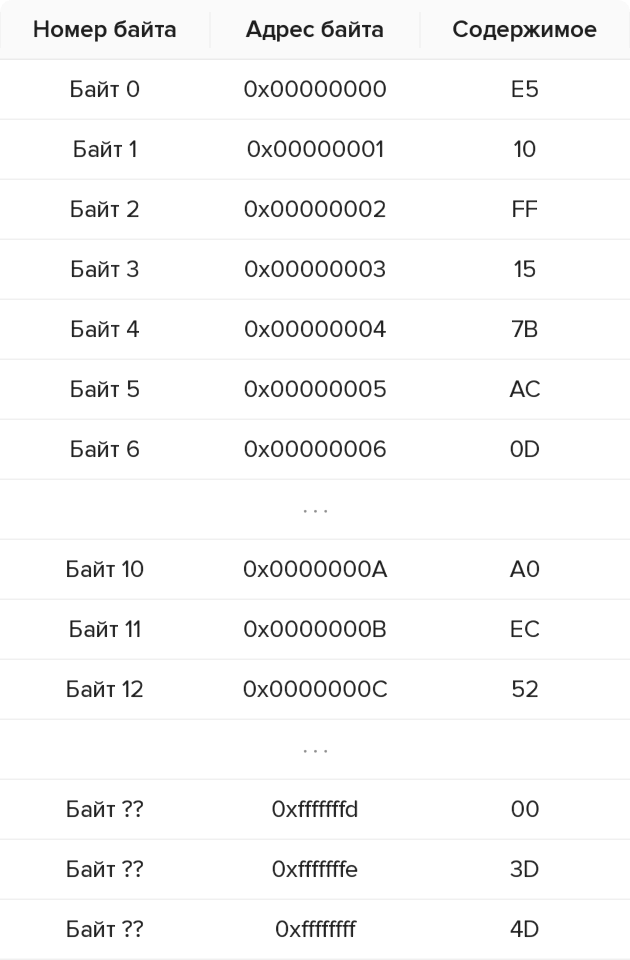
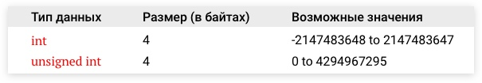
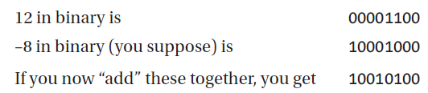
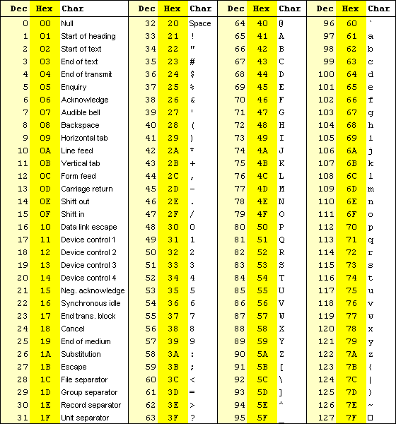

# Лекция 0.  Алгоритмы, задачи, вычислительные машины.

## Секция 4 -  Алгоритмы и данные

Любая программа состоит из алгоритма и данных. Программе необходимо уметь считывать входные данные, каким-то образом сохранять их и промежуточные результаты в памяти комьпютера и возвращать ответ.

Информация, с которой работает алгоритм, представлена в памяти компьютера в виде последовательностей нулей и единиц. Наименьшая единица хранения - бит/bit/binary digit (0 или 1). Наименьшая адресуемая единица хранения - байт/byte (последовательность из 8 бит).

Процессор обрабатывает информацию манипулируя блоками из фиксированного количества бит. Такой блок называется *машинное слово (word)*. В ранних компьютерах размеры машинного слова составляли 12 или 16 бит. В современных процессорах это значение обычно составляет 64 бита.

Как мы уже говорили ранее - двоичные последовительности достаточно громоздки для восприятия человеком. Для упрощения работы с данными один байт обычно делится на две *двоичные тетрады (tetrade, half-byte, nibble)*.

**Изображение 0.4.0 - Бит, байт, полубайт (тетрада), машинное слово**

**Источник: Данные - этот курс**

Каждую тетраду/полубайт удобно представлять в виде одной цифры в шестнадцатиричной системе счисления, потому что для ее представления нужно как раз 4 бита. 

**Изображение 0.4.0 - Hex цифры**

**Источник: Sedgewick & Wayne **

Двоичные данные, записанные в таком виде обычно называют hex кодами (hexadecimal).

**Изображение 0.4.0 - Двоичный код vs hex код**

**Источник: Sedgewick & Wayne **

Память компьютера можно рассматривать как очень большую ленту из  пронумерованных байтов.  Каждый ячейка содержит данные – значение от 0 до FF (две тетрады). 

**Изображение 0.4.0 - Упрощенная модели памяти**

**Источник: этот курс **

#TODO: переделать адреса последних 3 байт в верхний регистр

Эти значения могут интерпретироваться по-разному в зависимости от того, данные какой природы мы ожидаем в этой памяти.

**Изображение 0.4.0 - Различная возможная интерпретация двоичных данных**

**Источник: Данные - Sedgewick & Wayne, изображение - этот курс**

Работая с данными в языках программирования необходимо знать начальный адрес данных в памяти, размер объекта данных и природу данных, записанных в этой памяти. Манипулировать этими компонентами напрямую - неудобно и непрозрачно для человека. Именно поэтому работа с данными осуществляется с помощью *имён переменных* и *типов данных*.

**Имя переменной** – символьное обозначение адреса ячейки памяти, по которому хранится некоторое значение. Символьное имя позволяет понимать, о каких данных идет речь и упростить работу с ними.

Каждой переменной обычно соответствует некоторый **тип данных**.

Тип данных определяет:
- какого размера будет объект данного типа
- как будет интерпретироваться двоичная информация внутри объекта этого типа
- какие операции можно будет делать с объектами этого типа

**Изображение 0.4.2 - Пример содержимого объектов разных типов**

**Источник: ???**

Пример простейшей программы:

**Изображение 0.4.1 - Простая программа с целочисленными переменными**

**Источник: этот курс**

**Изображение 0.4.3 - Пример расположения переменных в памяти**

**Источник: ??? **

#TODO: Улучшить картинку, добавить decimal номера

### Типы данных

Существуют различные категории типов данных:

**Целые числа (int/integer)**
Беззнаковые целые числа (unsigned)
Числа со знаком (signed)

**Вещественные числа/числа с плавающей точкой (floating point):**
числа с обычной точностью (float)
числа с двойной точностью (double)

**Символы (character):**
Символы (char)
Строки

#### Беззнаковые целые числа (unsigned)

Стратегия хранения беззнаковых целых чисел достаточно тривиальна – хранится само число в двоичном виде без всяких модификаций.

short c = 10 ---> 00000000 00001010

**Изображение 0.4.4 - Возможные значения беззнаковых целочисленных типов**

**Источник: Sedgewick & Wayne**

#### Знаковые целые числа
В самом простом случае для представления отрицательных чисел в памяти компьютера можно использовать отдельных бит для знака (**sign bit**)

На практике знаковым битом всегда выбирается самый левый (старший) бит.

Пример: представим в 1 байте числа 6 и -6

  6  = 00000110, 
–6  = 10000110

Для изменения знака числа в данном случае надо лишь инвертировать старший (левый) бит. Для отрицательных чисел 1, для положительных 0.
Такой способ представления называется **signed magnitude**.

Преимущество: 
+ простота в понимании и использовании для человека  

Недостаток:
- высокая сложность в использовании компьютером: сломанная арифметика, два нуля и тд

Пример:

**Изображение 0.4.4 - Пример signed magnitude**

**Источник: -----**

Современные компьютеры используют другой подход: **two’s complement** представление.

В данном представлении мы получаем любое отрицательное число по следующему алгоритму

1. Переводим рассматриваемое положительное число в двоичную форму
2.  Инвертируем все биты числа, получаем так называемую **one’s complement form**
3.  Добавляем к полученному числу 1, получаем **two’s complement form**

**Пример**
1. Переводим +8 в двоичную систему → 00001000
2. Инвертируем биты 00001000 →  11110111
3. Добавляем 1 → 11110111  + 1 = 11111000

**Изображение 0.4.5 - Таблица примеров 4 битных представлений знаковых целых чисел**

**Источник: -----**

**Изображение 0.4.5 - Таблица примеров 16 битных представлений знаковых целых чисел**

**Источник: Sedgewick & Wayne**

Преимущества такого подхода: корректно работающая арифметика, один ноль (быстрая проверка на 0), быстрая проверка знака.

**Изображение 0.4.5 - Возможные значения знаковых целых чисел**

**Источник: Sedgewick & Wayne**

#### Числа с плавающей точкой (floating point)

Для представления дробных чисел компьютер имеет в своем распоряжении всё те же нули и единицы, однако задача усложняется.

Вещественные числа представляются в памяти компьютера как *числа с плавающей точкой*.

Число с плавающей точкой состоит из трёх частей:

1. **Знак (sign)**. Ничего необычного, знак представляется единственным битом, где 0 - положительное число, 1 - отрицательное. Быстрая проверка на отрицательность.
2. **Двоичная экспонента (binary exponent)**.  Хранит знаковое целое число. Состоит из
	- 5 бит (для 16 битных чисел)
	- 8 бит (для 32 битных чисел)
	- 11 бит (для 64 битных чисел)
	Записываются специальным образом в виде двоичного числа со сдвигом (offset binary). 

3.  **Мантисса (significand, mantissa, binary fraction)**.  Хранит знаковое целое число. Состоит из 
	- 10 бит (для 16 битных чисел)
	- 23 бита (для 32 битных чисел)
	- 53 бита (для 64 битных чисел)

Все эти компоненты представлены в двоичном формате.

**Изображение 0.4.6 - Стандарт представления чисел с плавающей точкой**

**Источник: Sedgewick & Wayne**

Знак, экспонента и мантисса преобразуются в вещественное число. 

**Изображение 0.4.6 - Преобразования вещественных чисел**

**Источник: Sedgewick & Wayne**

Вычисления, проводимые с числами с плавающей точкой, нужно проводить аккуратно. Такой способ представления не позволяет достаточно точно представить многие числа. При проведении операций (например, сложения), может появляться и накапливаться ошибка/погрешность. Чтобы снизить влияние этой проблемы обычно используют *числа двойной точности (double precision)*.

#### Символьные данные

**Символы (char)**

Символы не могут быть напрямую представлены в памяти компьютеры, поэтому они кодируются числами и создаются таблицы соответствия между кодами и самими символами. Такие таблицы называются **кодировками**.

В 1960х годах для представления символов была создана таблица ASCII (American Standard Code for Information Interchange).

Каждый код в этой таблице - 7 битное число, всего 128 разных варианта кодов.

**Коды:**
0-31 - символы, которые нельзя напечатать на клавиатуре
65-90 - латинские символы в верхнем регистре
97-122 - латинские символы в нижнем регистре.

**Изображение 0.4.7 - Таблица ASCII**

**Источник: -----**

## Вопросы

- **Вопрос 1.** #TODO: Добавить вопрос 1

- **Вопрос 2.** #TODO: Добавить вопрос 2
 
  
## Ссылки

#TODO: Добавить ссылки

[1] Brookshear J. G., Smith D., Brylow D. Computer science: an overview. – 2012.

[2] ---------------

[3] --------------------
