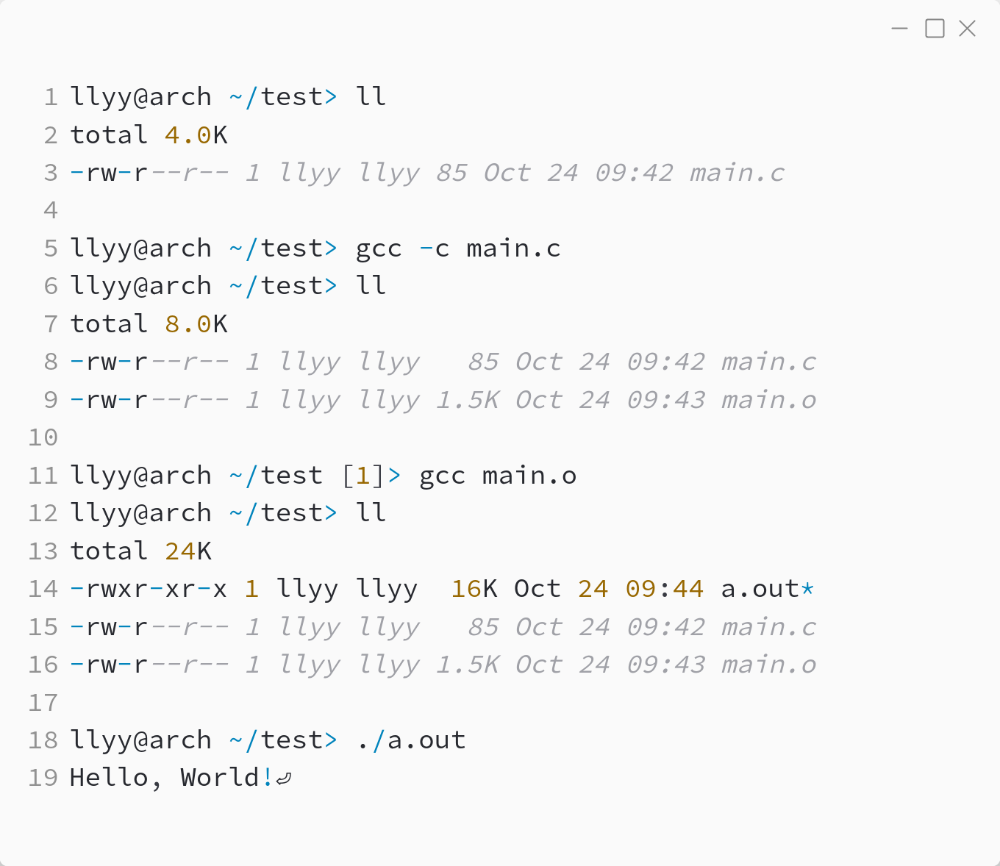

_Практика 0. Трансляция, переменные, типы данных, битовые операции._

# Cекция 0 - Введение в трансляцию, компиляция и линковка на языке C.

## Цели секции:

1. Посмотреть как исходный код на языке программирования C превращается в исполнямый машинный код

## Сценарий 1. Один файл
- Создаем файл с исходным кодом на языке C
- Запускаем компилятор, получаем объектный файл
- Запускаем линковщик, получаем исполняемый файл
- Запускаем исполняемый файл, проверяем результат работы кода

## Сценарий 2. Несколько файлов + библиотека (опционально)
- Создаем нейсколько файлов с исходным кодом на языке C
- Создаем библиотеку (опционально)
- Запускаем компилятор, получаем объектные файлы
- Запускаем линковщик, получаем исполняемый файл
- Запускаем исполняемый файл, проверяем результат работы кода

[plan](../practice.md) | [>](1.md)
