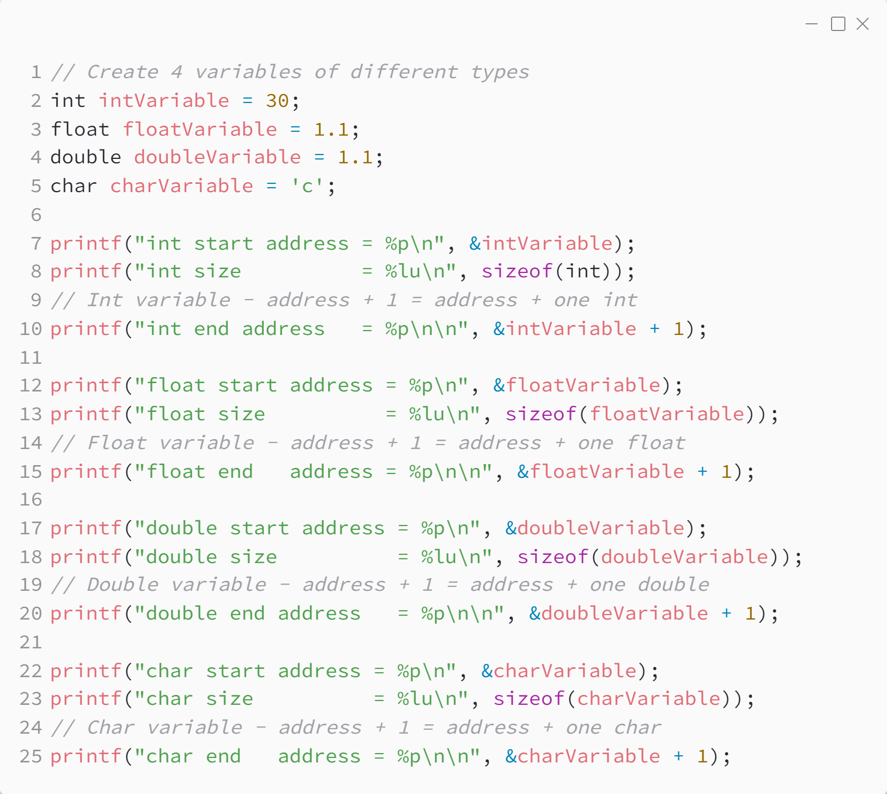
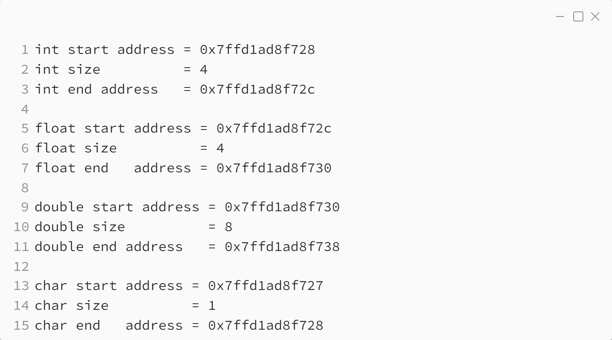

_Практика 0. Трансляция, переменные, типы данных, битовые операции._

# Секция 1 - Адреса и переменные.

## Цели секции:

1. Изучить как размер и адрес переменной в памяти зависит от её типа

## Пример с переменными разных типов и их адресами

Исходный код - [addresses.c](../src/addresses.c)

### Исходный код программы:

### Результат выполнения программы:

[<](0.md) | [plan](../practice.md) | [>](2.md)
