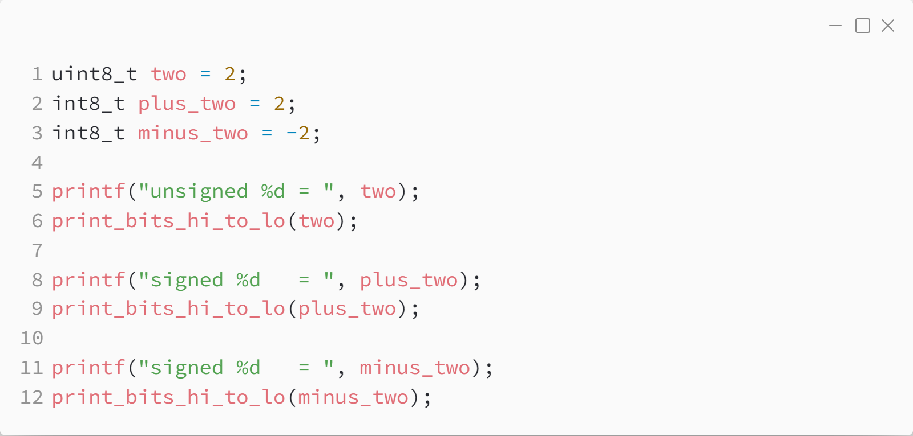
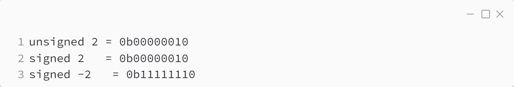
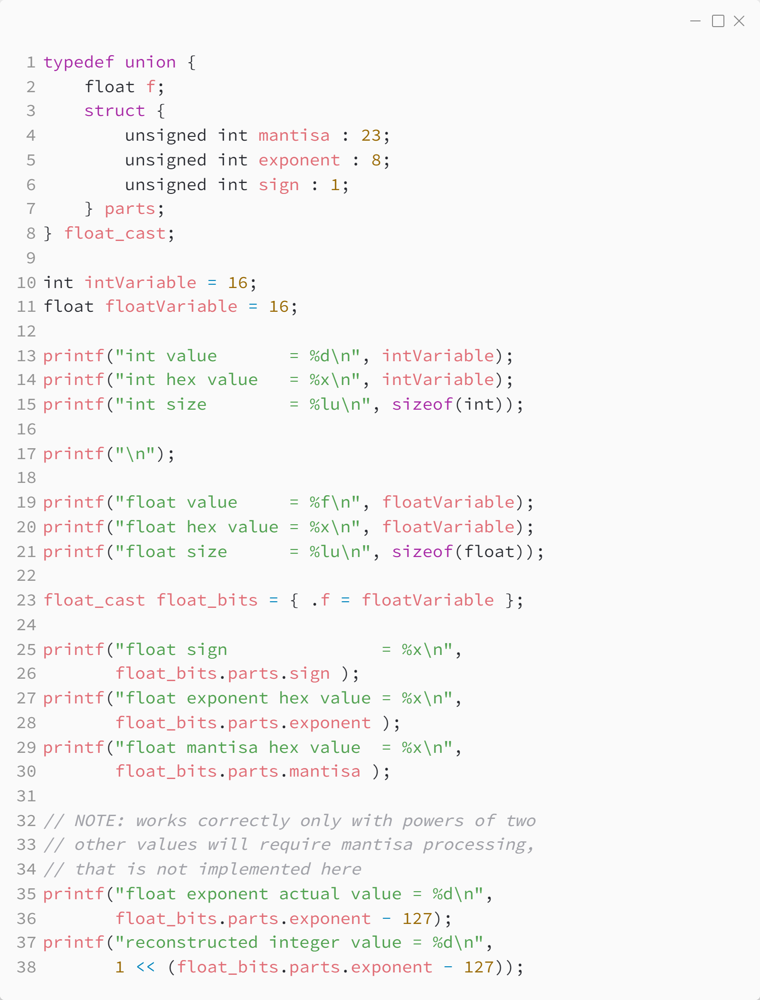
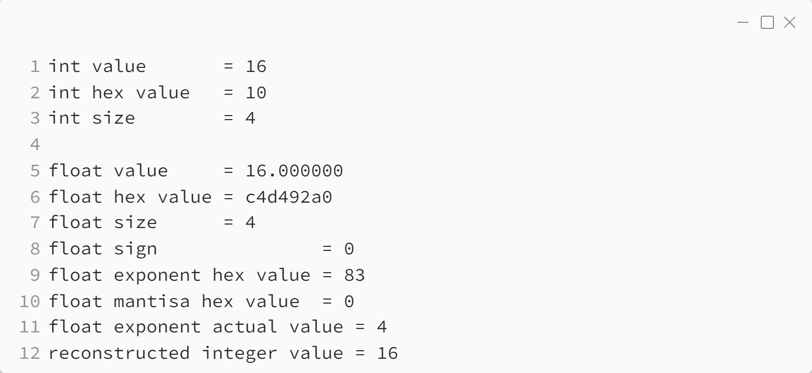

_Практика 0. Трансляция, переменные, типы данных, битовые операции._

# Секция 2 - Типы данных.

## Цели секции:

1. Изучить как в памяти хранятся знаковые и беззнаковые типы данных
2. Изучить как в памяти хранятся типы данных с плавающей точкой

## Пример хранения знаковых и беззнаковых типов данных
Исходный код - [signed_unsigned.c](../src/signed_unsigned.c)

### Исходный код программы:

> В этом коде используется функция `print_bits_hi_to_lo`. Функции - механизм языка Си, позволяющий переиспользовать код. В данном примере нам нужно трижды вывести битовое представление числа в консоль. Вместо дублирования кода мы используем функцию и несколько раз вызываем её. Реализация этой фукции будет приведена далее.

### Результат выполнения программы:

## пример хранения типа данных с плавающей точкой
Исходный код - [int_and_float.c](../src/int_and_float.c)

### Исходный код программы:

Приведённый ниже код сложен для понимания. Это вызвано тем, что числа с плавающей точкой сильно отлитчаются по своей структуре от целочисленных чисел. Операции с числами с плавающей точкой в современных процессорах выполняются отдельным прифметическим устройством, и на практике приведённый ниже пример работы с числами с плавающей точкой не используется. Данный пример направлен на демонстрайцию разницы хранения целочисленных и нецелочисленных типов данных в памяти.

> В этом коде используется `union` - этот механизм языка Си позволяющий удобно обращаться к отдельным битам в памяти. Аналогичное обращение к отдельным битам может быть реализовано с помощью битовых операций. О битовых операциях будет рассказано далее.

### Результат выполнения программы:

[<](1.md) | [plan](../practice.md) | [>](3.md)
