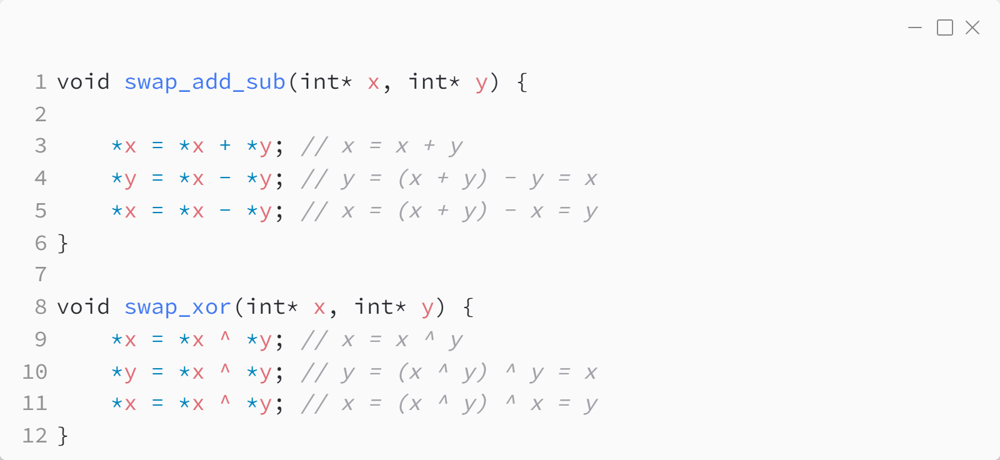

_Практика 0. Трансляция, переменные, типы данных, битовые операции._

# Секция 3 - Битовые операции.

## Цели секции:

1. Изучить различные числовые литералы
2. Изучить битовые операции

## Пример числовых литералов
Исходный код - [literals_example.c](../src/literals_example.c)

### Исходный код программы:

### Результат выполнения программы:

## Пример битовых операторов
Исходный код - [bitwise_operator_example.c](../src/bitwise_operator_example.c)

### Исходный код программы:

### Результат выполнения программы:

## Пример обмена значениями (числа + произвольные биты)
Исходный код - [swap_variables.c](../src/swap_variables.c)

### Исходный код программы:

### Результат выполнения программы:

## Пример двоичных масок и сдвигов
Исходный код - [print_bits.c](../src/print_bits.c)

### Исходный код программы:

[<](2.md) | [plan](../practice.md) | [>](4.md)
