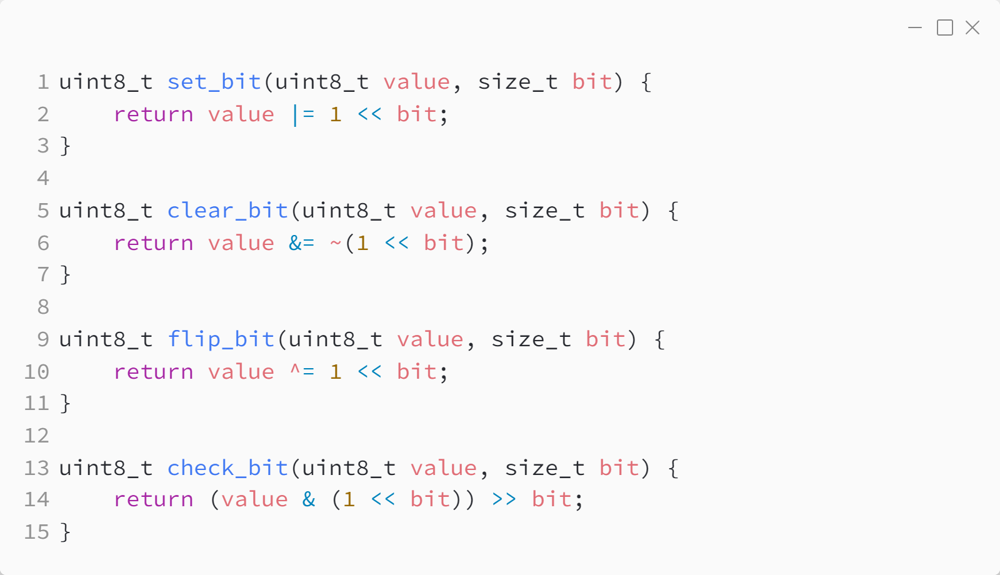
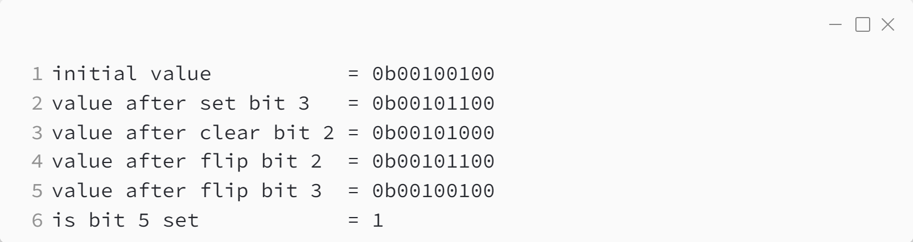
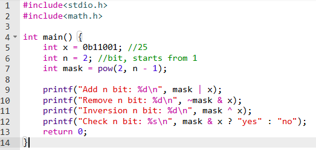

_Практика 0. Трансляция, переменные, типы данных, битовые операции._

# Задача 0 - Решение.

Исходный код - [bitop_oneline.c](../src/bitop_oneline.c)\

### Исходный код программы:

### Результат выполнения программы:

# Задача 0 - Альтернативное решение.

Исходный код - [bitop_oneline_alternative.c](../src/bitop_oneline_alternative.c)

### Исходный код программы:

### Результат выполнения программы:

### Замечание
pow(2, n) можно заменить эквивалентным побитовым сдвигом: 1 << n.\
В реальных проектах лучше использовать побитовый сдвиг, так как он реализуются на уровне процессора как очень быстрая машинная инструкция, а возведение в степень требует большего числа операций, что негативно влияет на производительность.

[<](4.md) | [plan](../practice.md) | [>](6.md)
