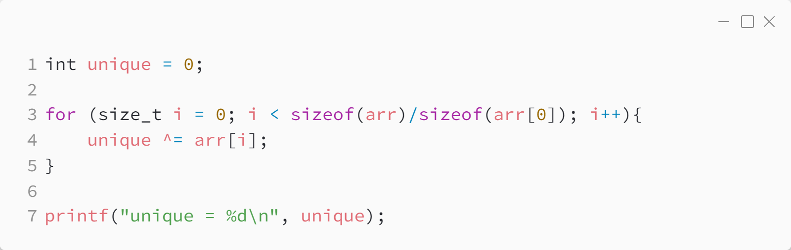

_Практика 0. Трансляция, переменные, типы данных, битовые операции._

# Задача 1 - Решение

Исходный код - [find_unique.c](../src/find_unique.c)

### Исходный код программы:

[<](6.md) | [plan](../practice.md)
