# 2. Адреса и переменные

## пример с переменными разных типов и их адресами
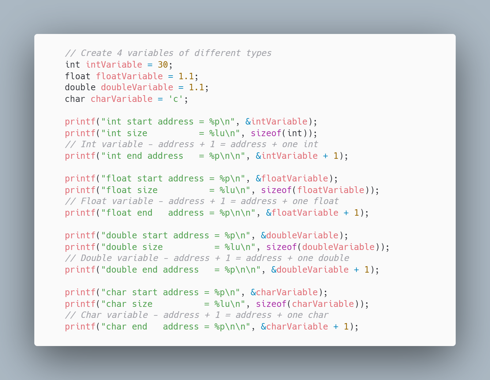
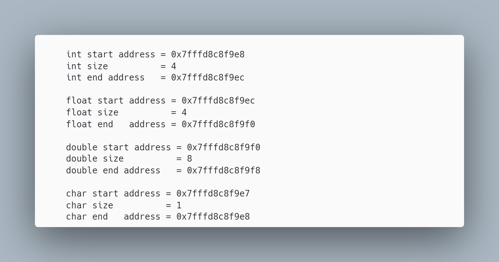

# 3. Типы данных

## пример хранения signed и unsigned
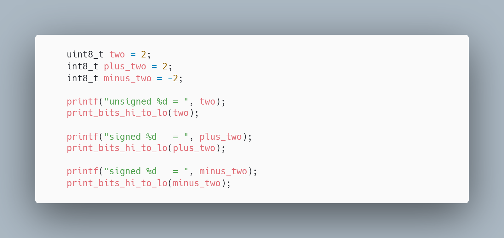
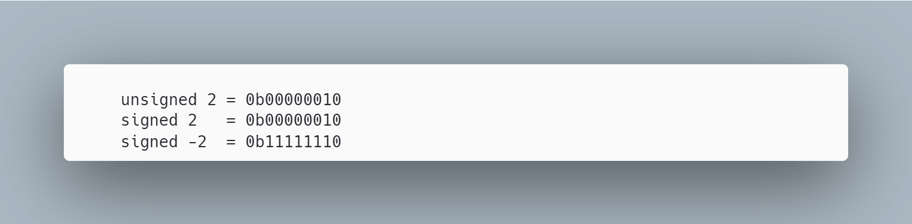

## пример хранения float
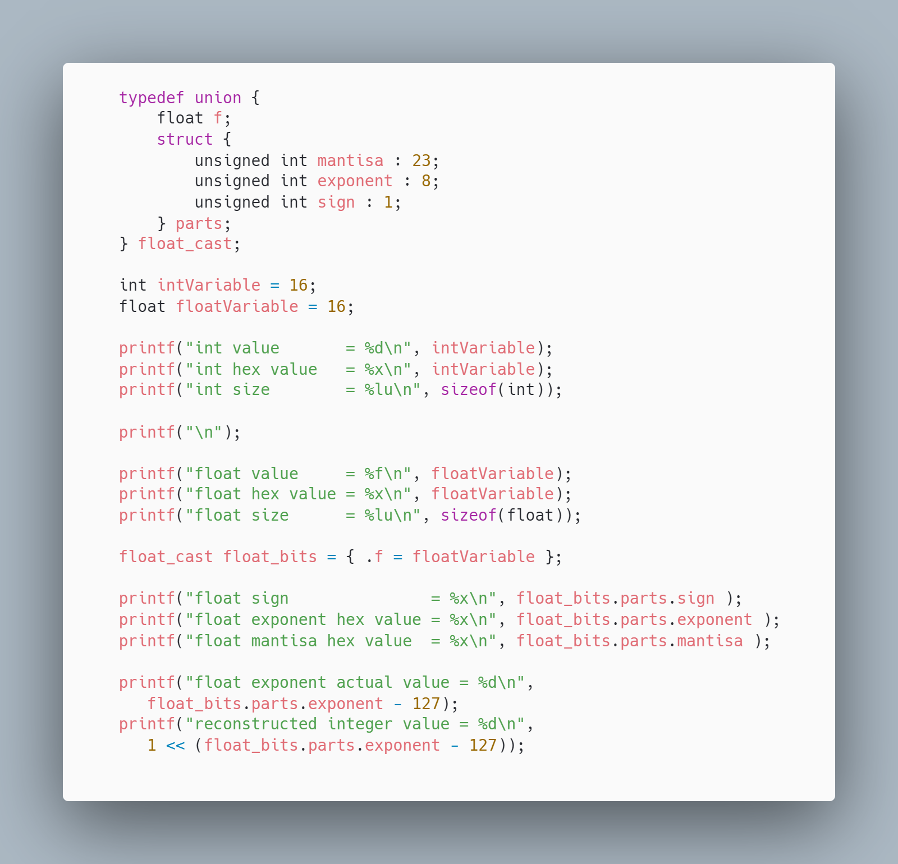
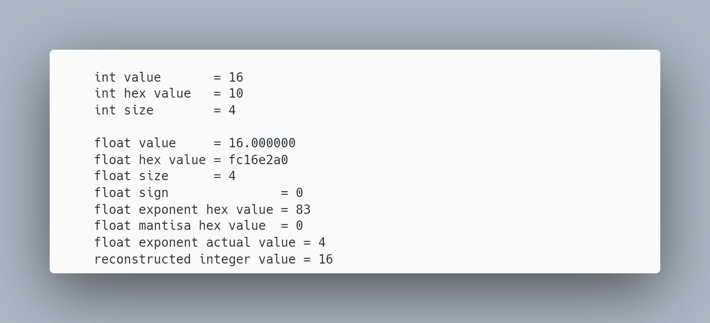

# 4. Битовые операции и задачи

## пример числовых литералов
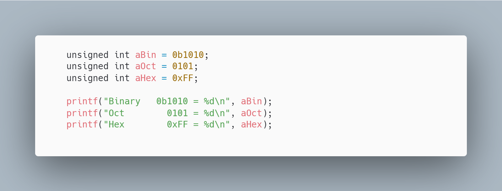
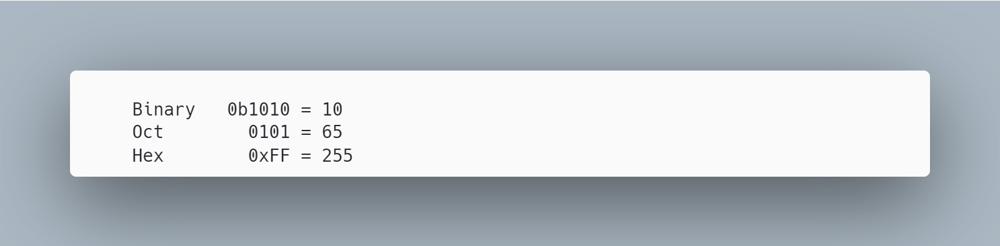

## пример битовых операторов
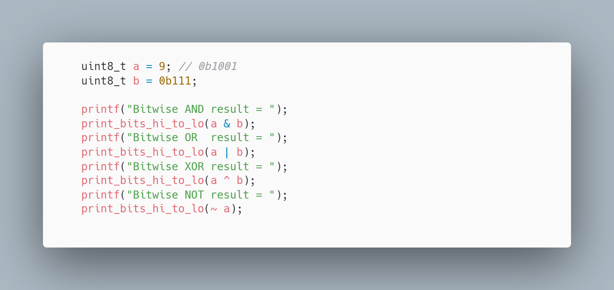
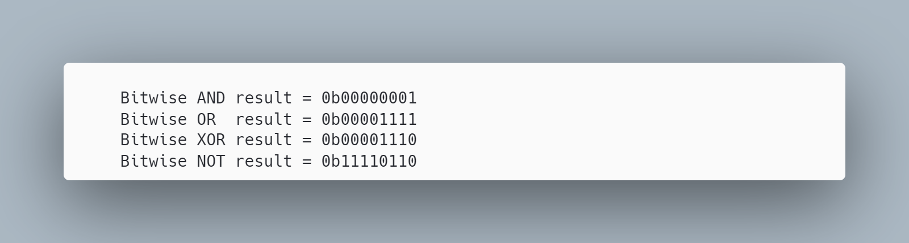

## пример обмена значениями (числа + произвольные биты)
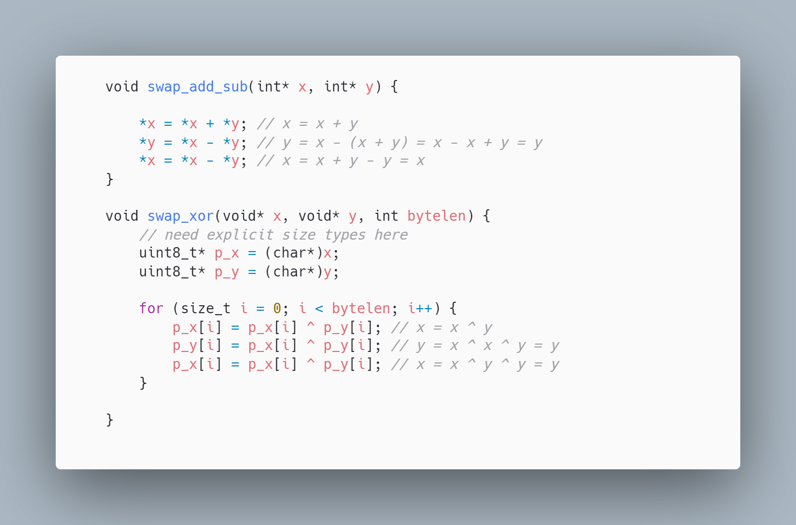

## пример двоичных масок и сдвигов

# Задача 1: Установка бита, очистка бита, инверсия бита, nроверка бита

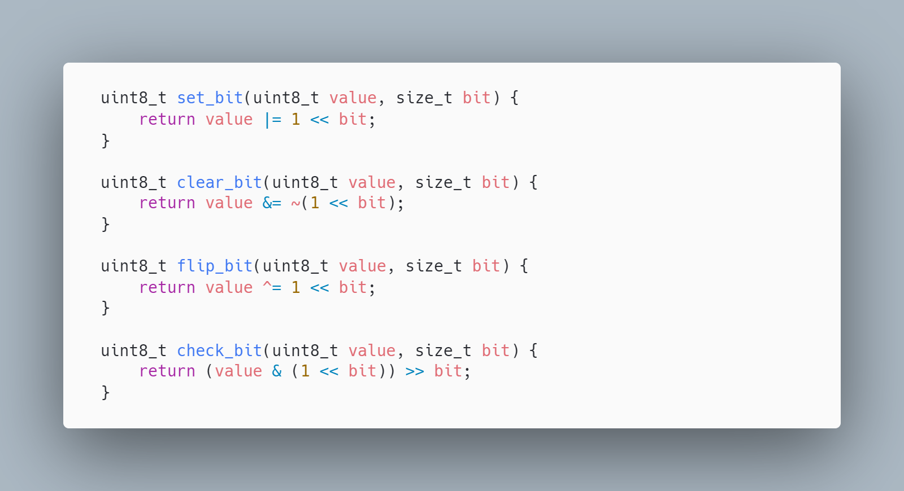
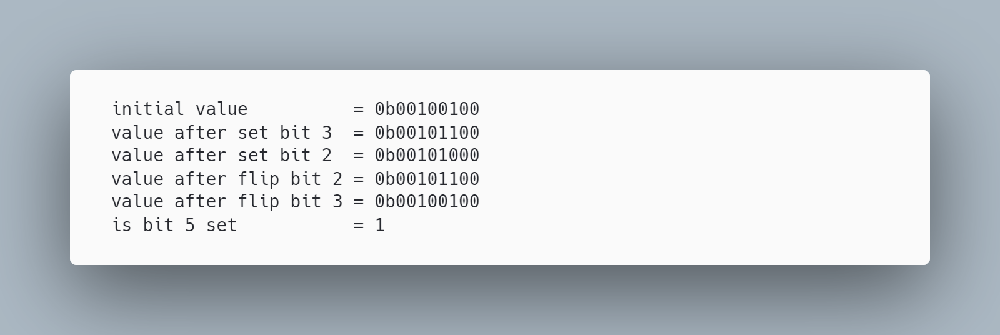

# Задача 2: Дан массив, в котором одно число уникально, а остальные встречаются ровно два раза. Найти уникальное число.

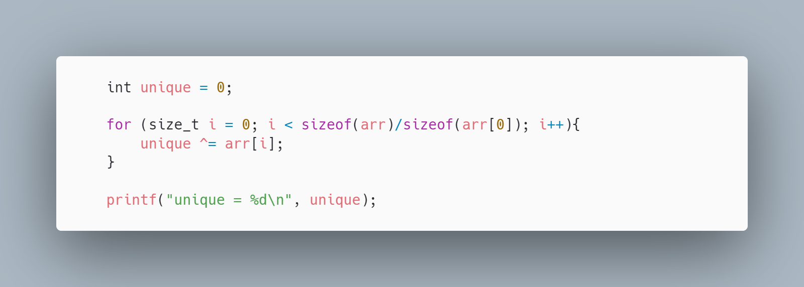

# Исходный код

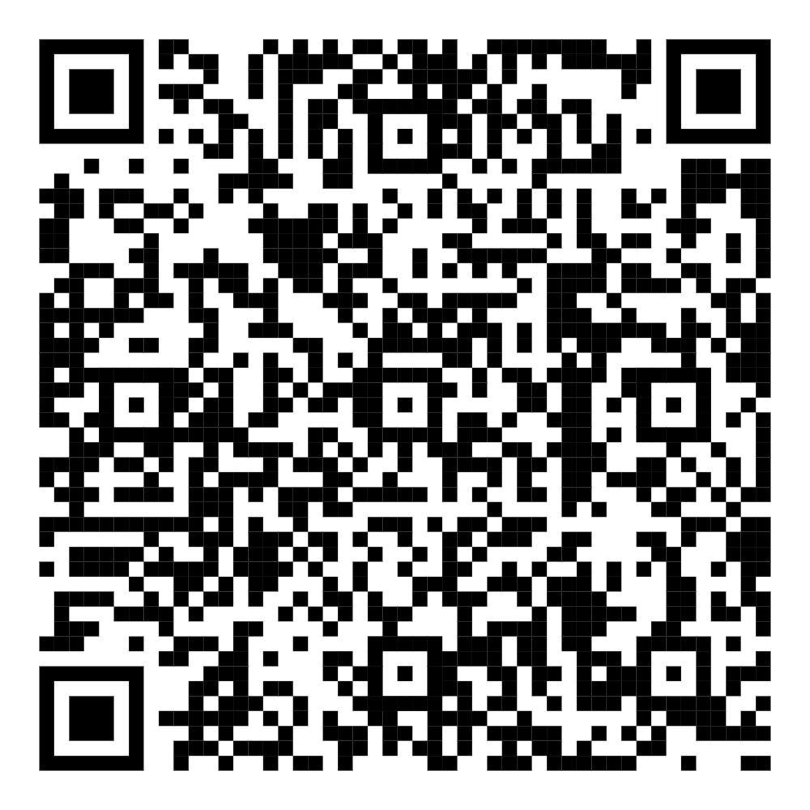
