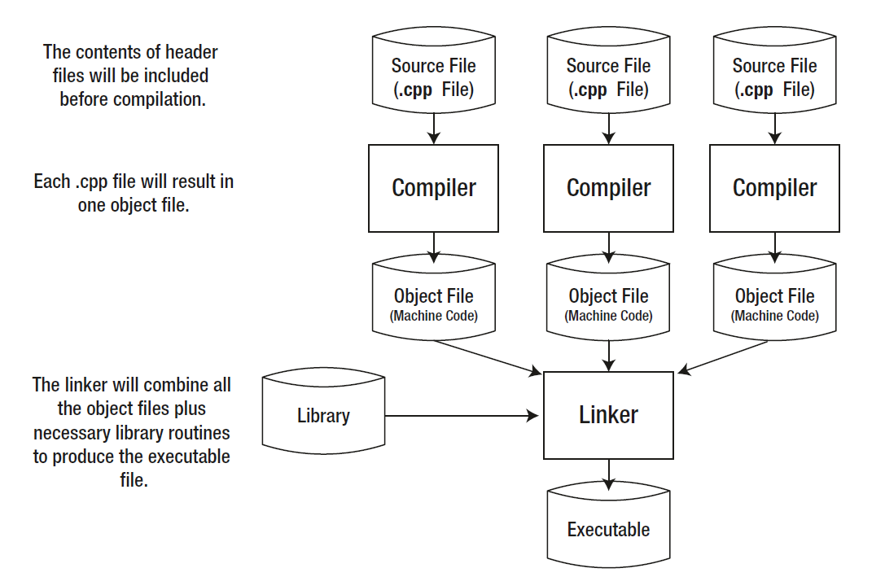

# Практическое занятие 0
## Адреса, переменные, массивы и алгоритмы на массивах

### Секция 0: Введение в трансляцию и компиляцию на языке C

Повторить материал лекции [Трансляция и компиляция](../0_3_programms.md#Трансляция)
  
Компилятор в отличии от интерпретатора осуществляет перевод **всего исходного кода** на машинный язык, одновременно проверяя ее правильность.

В процессе компилятор включает подпрограммы и функции, которые связываются со всей программой.

Этот этап называется **компоновкой(линковкой)** и обеспечивается еще одной специальной программой - **компоновщиком (linker)**.

Результатом работы компилятора является исполняемый файл.

Как происходит процесс создания исполняемого файла:

1. Компилятор отдельно переводит в машинный код каждый файл с исходным кодом (.c)
2. В результате появляются так называемые объектные файлы (.o, для каждого файла .c)
3. Далее все объектные файлы машинного кода + внешние библиотеки соединяются в один исполняемый файл с помощью компоновщика.
   



#TODO: (@FLTLN) Вставить примеры работы с компилятором из командной строки: простая компиляция одного cpp, компиляция нескольких файлов, возможно компиляция с библиотекой. Простой helloworld.


### Секция 1: Адреса и переменные

### **FULL LIVE CODING**

**Исходный код:** addresses.с

**Заметка:** В данном примере необходимо:
- напомнить, что страшные hex адреса это просто номера байт (возможно перевести один в десятичную систему и сказать - вот, это 9999999й байт)
- создать несколько переменных разных типов и показать как для них выделилась память
- показать размеры различных типов данных (в качестве примеров)
- показать адресную арифметику - добавление 1 к разным типам данных


**!!!ВАЖНО!!!:**
- в выводе посчитать и показать, что действительно адрес + 1 получается новый адрес
(адрес потенциального начала следующей переменной такого же типа)

```c 
#include <stdio.h>
int main()
{
    // Create 4 variables of different types
    int intVariable = 30;
    float floatVariable = 1.1;
    double doubleVariable = 1.1;
    char charVariable = 'c';
    
    printf("int start address = %p\n",&intVariable);
    printf("int size          = %lu\n",sizeof(int));
    // Int variable - address + 1 = address + one int
    printf("int end address   = %p\n\n",&intVariable + 1);

    printf("float start address = %p\n",&floatVariable);
    printf("float size          = %lu\n",sizeof(floatVariable));
    // Float variable - address + 1 = address + one float
    printf("float end   address = %p\n\n",&floatVariable + 1);

    printf("double start address = %p\n",&doubleVariable);
    printf("double size          = %lu\n",sizeof(doubleVariable));
    // Double variable - address + 1 = address + one double
    printf("double end address   = %p\n\n",&doubleVariable + 1);

    printf("char start address = %p\n",&charVariable);
    printf("char size          = %lu\n",sizeof(charVariable));
    // Char variable - address + 1 = address + one char
    printf("char end   address = %p\n\n",&charVariable + 1);
}
```

**Пример вывода:** addresses.c
```bash
$ ./a.out 
int start address = 0x7ffeed9c5b4c
int size          = 4
int end address   = 0x7ffeed9c5b50

float start address = 0x7ffeed9c5b48
float size          = 4
float end   address = 0x7ffeed9c5b4c

double start address = 0x7ffeed9c5b40
double size          = 8
double end address   = 0x7ffeed9c5b48

char start address = 0x7ffeed9c5b3f
char size          = 1
char end   address = 0x7ffeed9c5b40
```

### Секция 2: Адреса и массивы

### **FULL LIVE CODING**

**Исходный код:** addresses_arrays.c

**Заметка:** В данном примере необходимо:
- напомнить, что данные в массиве однотипны и располагаются в памяти последовательно
- создать массив переменных int
- с помощью цикла вывести информацию по всем элементам - смещение, значение, адрес
- пройтись по нескольким элементам вручную и показать что между ними правильное число байт (посмотреть разницу между адресами)


```c 
#include <stdio.h>

#define ARR_SIZE 10

int main()
{
    // Initialize an array
    int intArray[ARR_SIZE] = {10, 11, 12, 13 ,14 ,15 ,16 ,17, 18, 19};

    // Print an address of every array element
    for (int i = 0; i < ARR_SIZE; i++)
        printf("int array element shift = [%d] -  value stored = %d  - address = %p\n",i, intArray[i], &intArray[i]);
    return 0;
}
```

**Пример вывода:** addresses.c
```bash
$ ./a.out 
int array element shift = [0] -  value stored = 10  - address = 0x7ffee9b45b20
int array element shift = [1] -  value stored = 11  - address = 0x7ffee9b45b24
int array element shift = [2] -  value stored = 12  - address = 0x7ffee9b45b28
int array element shift = [3] -  value stored = 13  - address = 0x7ffee9b45b2c
int array element shift = [4] -  value stored = 14  - address = 0x7ffee9b45b30
int array element shift = [5] -  value stored = 15  - address = 0x7ffee9b45b34
int array element shift = [6] -  value stored = 16  - address = 0x7ffee9b45b38
int array element shift = [7] -  value stored = 17  - address = 0x7ffee9b45b3c
int array element shift = [8] -  value stored = 18  - address = 0x7ffee9b45b40
int array element shift = [9] -  value stored = 19  - address = 0x7ffee9b45b44
```
