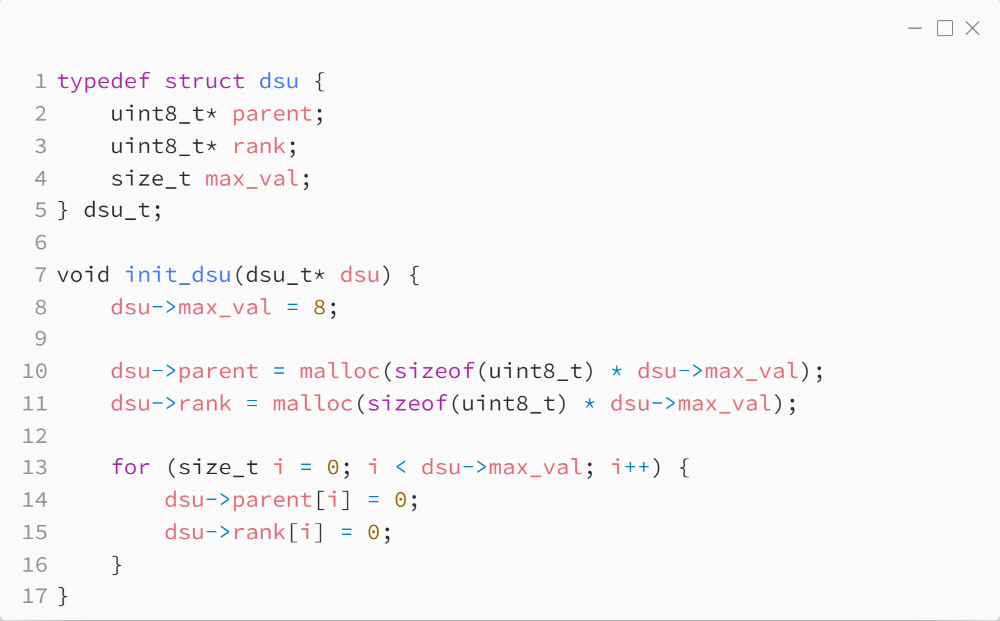
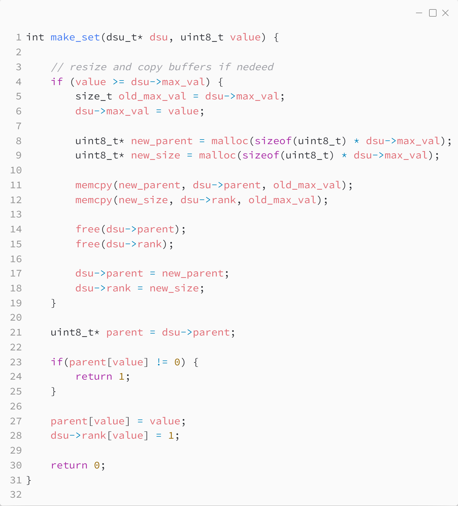
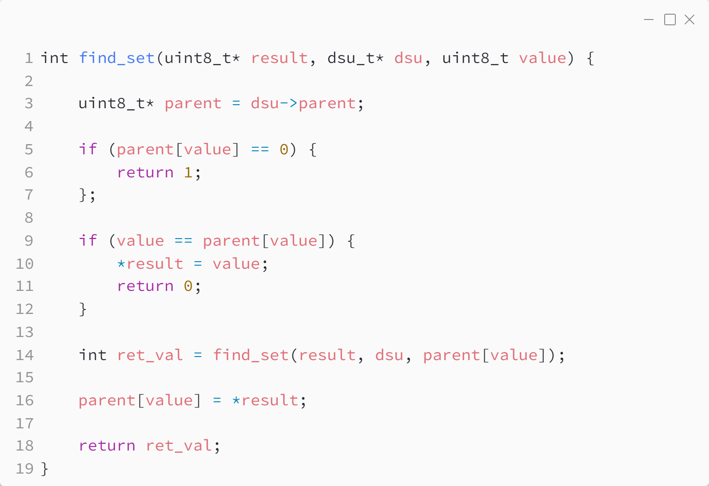
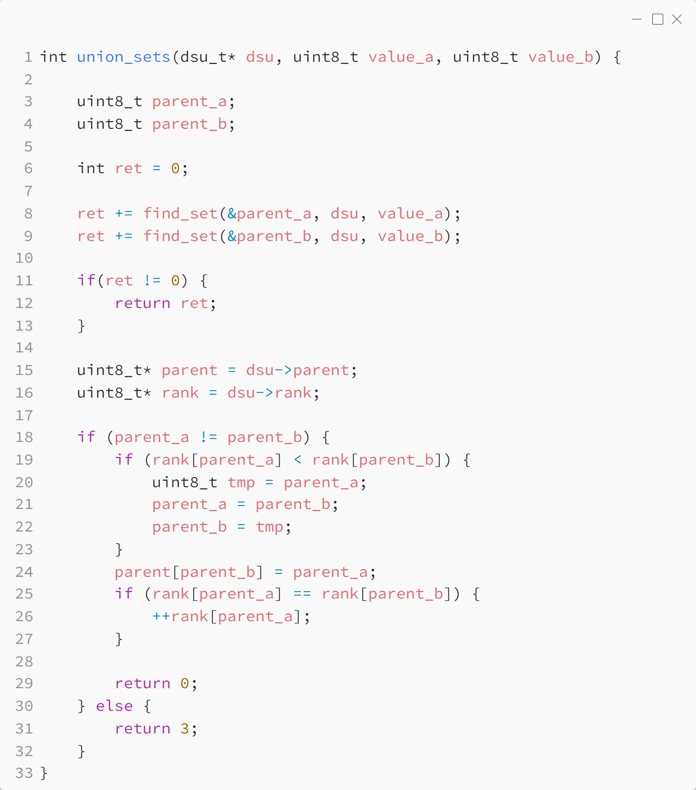

_Практика 10. Системы непересекающихся множеств. Графы, введение._

# Секция 0 - Сисемы непересекающихся множеств.

Исходный код - [dsu.c](../src/dsu.c)

### Структуры данных:

### Сздание множества:

### Поиск множества:

### Объединение множеств:

[plan](../practice.md) | [>](1.md)
