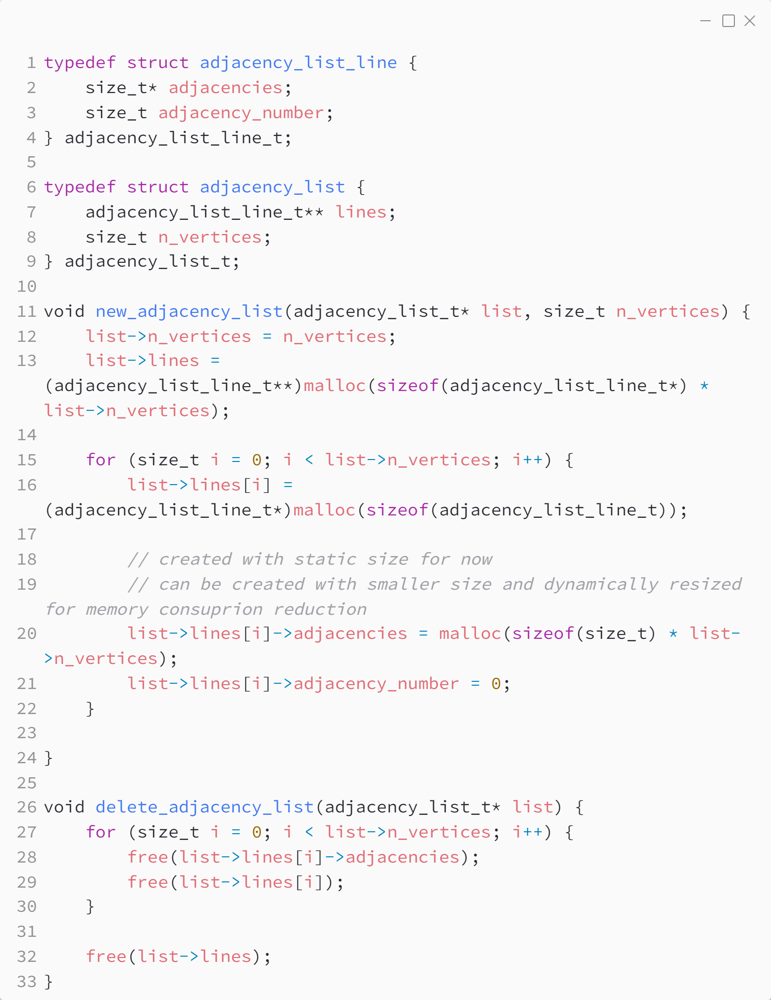
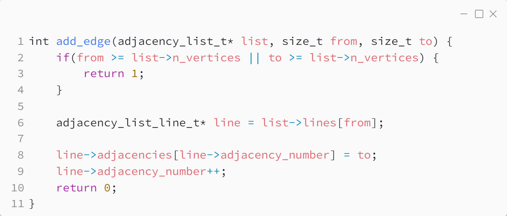
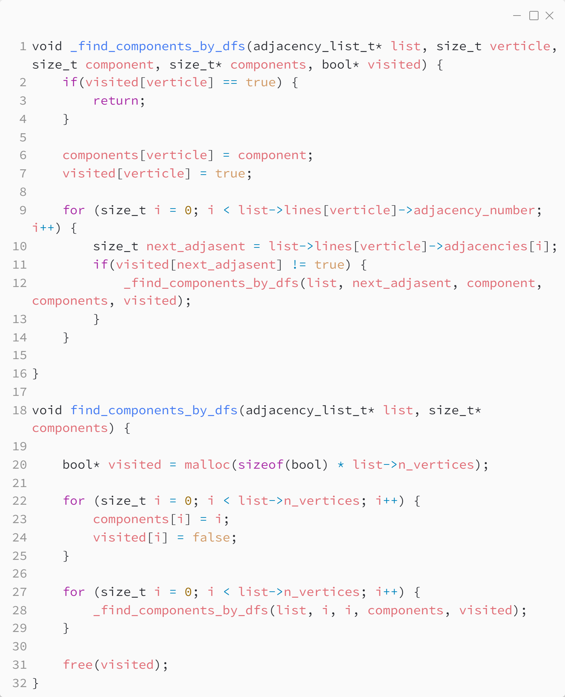

_Практика 10. Системы непересекающихся множеств. Графы, введение._

# Секция 1 - Графы. Список смежности.

Исходный код - [adjacency_list.c](../src/adjacency_list.c)

### Структуры данных:

### Добавление элемента:

### Поиск компонент связности:

[<](0.md) | [plan](../practice.md) | [>](2.md)
