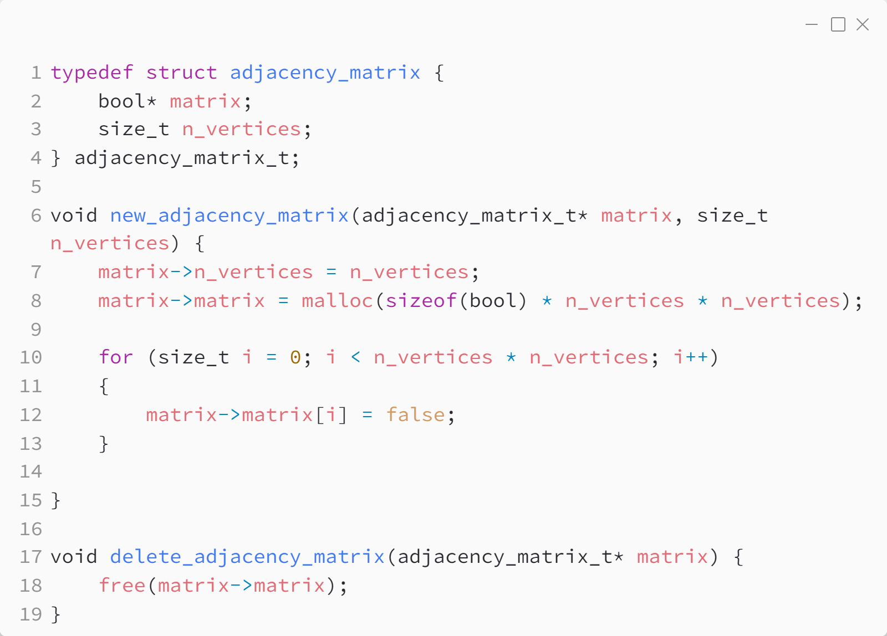
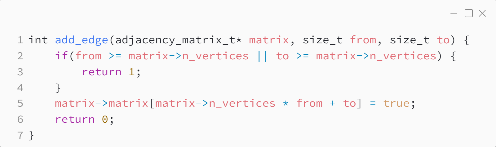
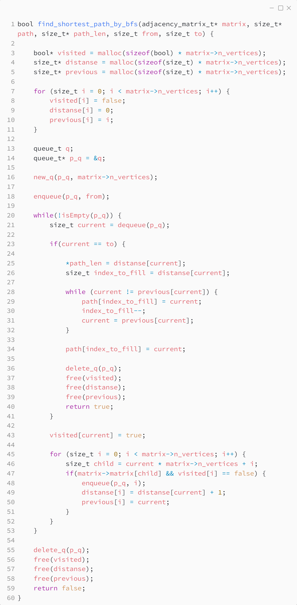

_Практика 10. Системы непересекающихся множеств. Графы, введение._

# Секция 2 - Графы. Матрица смежности.

Исходный код - [adjacency_matrix.c](../src/adjacency_matrix.c)

### Структуры данных:

### Добавление элемента:

### Поиск кратчайшего пути:

[<](1.md) | [plan](../practice.md) | [>](3.md)
