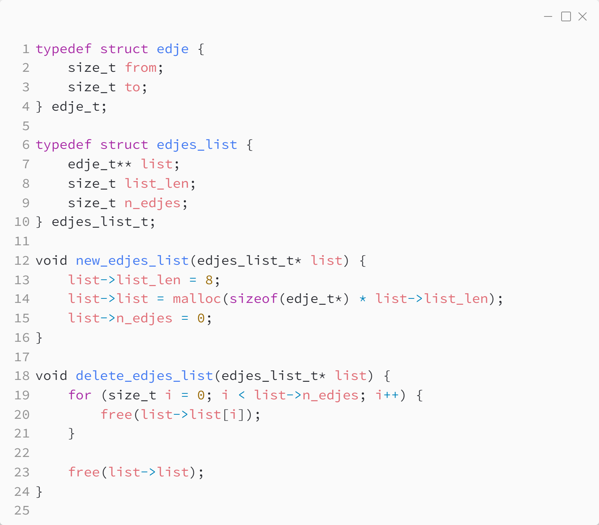
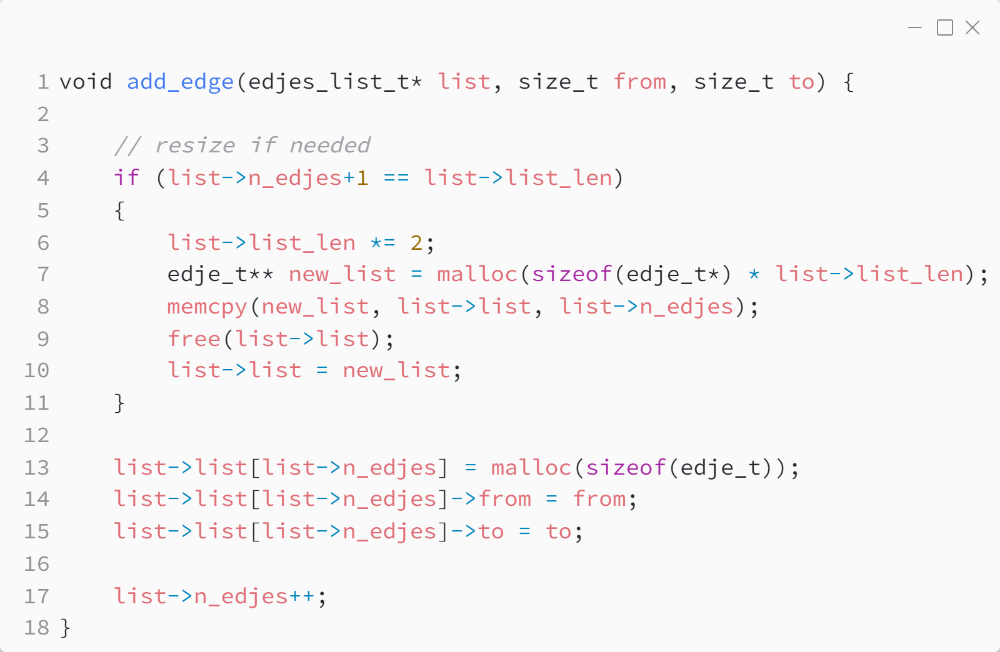

_Практика 10. Системы непересекающихся множеств. Графы, введение._

# Секция 3 - Графы. Список рёбер.

Исходный код - [edges_list.c](../src/edges_list.c)

### Структуры данных:

### Добавление элемента:

[<](2.md) | [plan](../practice.md)
