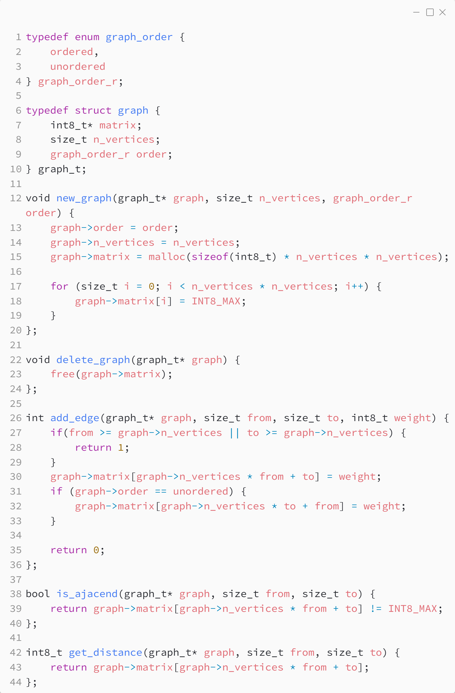
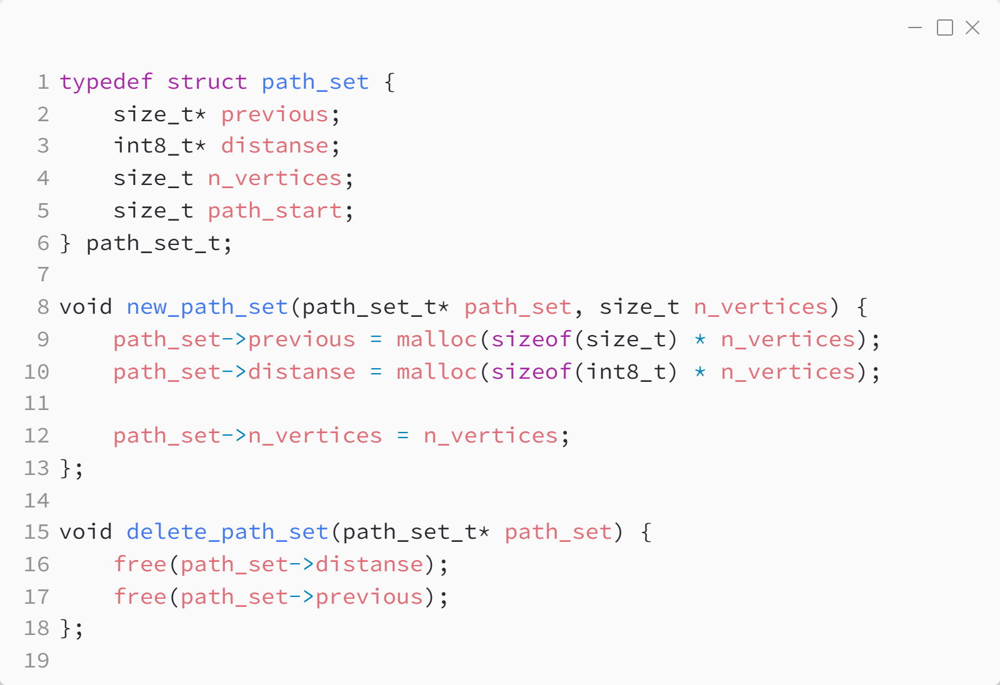

_Практика 11. Поиск пути в графе._

# Cекция 0 - Вспомогательные функции.

Исходный код - [dijkstra.c](../src/dijkstra.c), [bellman_ford.c](../src/bellman_ford.c), [floyd_warshall.c](../src/floyd_warshall.c)

### Граф:

### Набор путей:

[plan](../practice.md) | [>](1.md)
