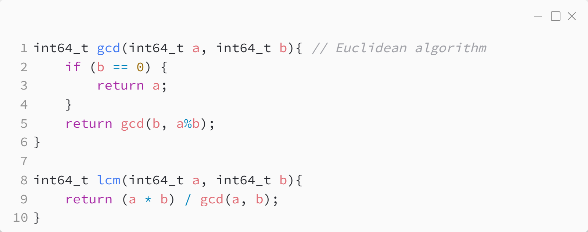

_Практика 13. Основы теории чисел._

# Секция 0 - Наибольший общий делитель и наименьшее общее кратное.

Исходный код - [prime_numbers.c](../src/prime_numbers.c)

[plan](../practice.md) | [>](1.md)
