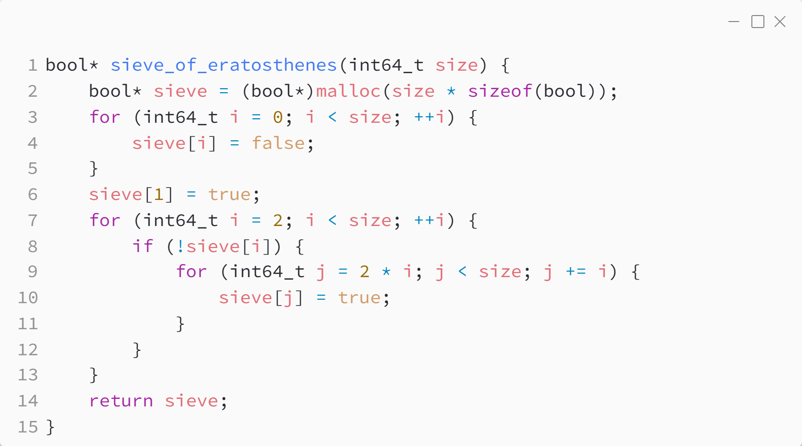

_Практика 13. Основы теории чисел._

# Секция 1 - Геренария простох чисел. Решето Эратосфена.

Исходный код - [prime_numbers.c](../src/prime_numbers.c)

[<](0.md) | [plan](../practice.md) | [>](2.md)
