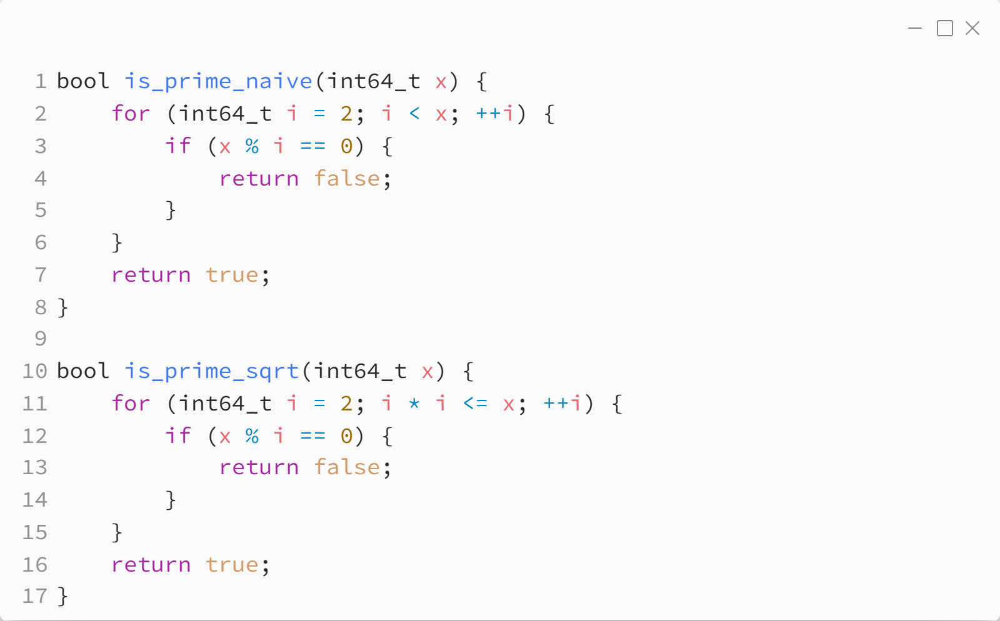

_Практика 13. Основы теории чисел._

# Секция 2 - Проверка числа на простоту. Наимвный метод.

Исходный код - [prime_numbers.c](../src/prime_numbers.c)

[<](1.md) | [plan](../practice.md) | [>](3.md)
