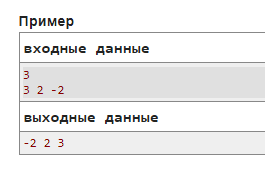
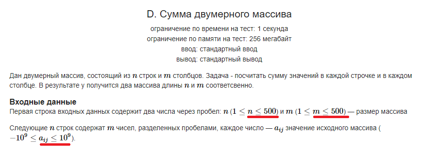

_Практика 1. Тестирование. Работа с массивами._

# Cекция 0 - Тестирование.

## Цели секции:

1. Изучить основы подходов к тестированию собственного кода

## К чему может привести недостаточное тестирование кода

* [Therac-25](https://ru.wikipedia.org/wiki/Therac-25)
* [Как синий экран смерти остановил работу аэропортов и предприятий](https://habr.com/ru/articles/830280/)

## Вывод
К тестированию собственных программ важно подходить очень ответственно и вдумчиво.

Вот категории тестов, которые стоит рассмотреть при тестировании:

* Тесты, описанные в условии задачи
* Тесты наименьшего размера/тривиальные тесты
* Тесты с наибольшими возможными данными
* Тесты с различными типами ответов

## Тесты, описанные в условии задачи

Как правило, в условии задач даётся не менее одного примера с входными данными и верным ответом для них.
Эти тесты должны быть проверены в первую очередь, с высокой долей вероятности они есть в проверочном наборе.
Более того, на тестах из условия обычно можно проверить формат и вид выводимого ответа.
В данном случае нужно быть предельно внимательным - часто даже небольшое отличие (не хватает пробелов между элементами,
символы в разных регистрах) может привести к вердикту `WRONG ANSWER`, даже если по сути ответ правильный.

Простой пример: задача с обменом элементов

В данном случае мы видим что ответ предполагается одну единственну строку - нужно вывести элементы массива через пробел.
Это простой случай, однако в дальнейшем будут встречаться более сложные форматы вывода ответов, будьте внимательны.

## Тесты наименьшего размера/тривиальные тесты
Самое простое что можно протестировать самостоятельно - тесты наименьшего размера.
Например, если речь идет о некоторой коллекции элементов, всегда нужно проверять случаи когда элементов всего 1 или даже 0 (конечно, если это предусмотрено интервалами входных параметров). Часто на таких маленьких примерах программы даже ломаются, уходят в бесконечные циклы или даже получают ошибки при обращении к неразрешенному участку памяти.
В других случаях, для наименьших тестов может отличаться или не работать логика, корректная для остальных.

## Тесты с наибольшими возможными данными
Такие тесты обычно содержат граничные допустимые значения переменных задачи.
Например, максимально возможное число элементов в соответствии с условием. Или максимально большие значения элементов.
Тесты с наибольшими данными призваны проверить несколько вещей:
- укладывается ли предложенный Вами алгоритм в ограничение по времени
- укладывается ли предложенный Вами алгоритм в ограничение по памяти
- правильно ли выбраны типы данных внутри алгоритма, нет ли ошибок переполнения типов

Несмотря на то, что с опытом оценить время и память часто можно без использования дополнительных тестов, иногда бывает необходимо даже написать отдельную программу, которая генерирует большой тест.

Пример из задачи про суммы:

В задаче про суммы максимальными тестами можно считать:
- тесты с граничными значениями элементов $a = 10^9$, $a = -10^9$
- тесты массивов с максимальным числом элементов - например, массив из 500 строк и 500 столбцов
- оба пункта выше одновременно

## Тесты с различными типами ответов
Иногда, корректному алгоритму необходимо концептуально по-разному реагировать на входные данные разных типов.
Например, для четного количества элементов массива логика может отличаться (из условия задачи) от логики для нечетного количества элементов.
Или, если речь идет о таком классе задач как игры, на часть примеров нужно будет ответить, например, "Выиграет первый игрок", а на другую "Выиграет второй игрок".
Важно придумать по несколько тестов для каждого возможного варианта ответов вашего алгоритма.

[plan](../practice.md) | [>](1.md)
