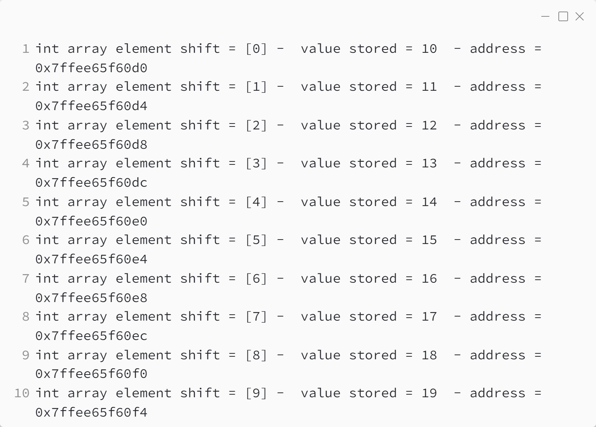

_Практика 1. Тестирование. Работа с массивами._

# Cекция 1 - Адреса и массивы..

## Цели секции:

1. Изучить как массивы располагаются в памяти

Исходный код - [addresses_arrays.c](../src/addresses_arrays.c)

### Исходный код программы:

### Результат выполнения программы:

[<](0.md) | [plan](../practice.md) | [>](2.md)
