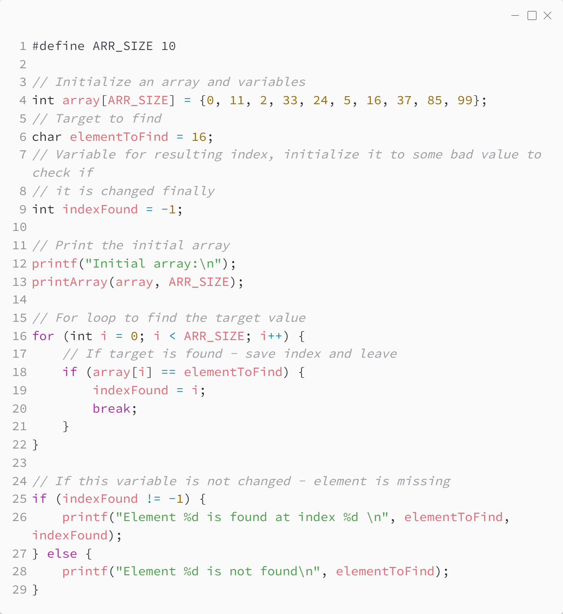

_Практика 1. Тестирование. Работа с массивами._

# Cекция 4 - Массивы - поиск элемента. Измерение производительности поиска.

## Цели секции:

1. Изучить операцию поиска элемента в массиве

## Поиск элемента в массиве

Исходный код - [find_element_index_alg.c](../src/find_element_index_alg.c)

### Исходный код программы:

### Результат выполнения программы:

## Производительность операции поиска элемента в массиве

Исходный код - [find_element_index_perf.c](../src/find_element_index_perf.c)

### Сценарий измерения производительности
* написан специальный код для экспериментов
* операция поиска будет рассмотрена для следующих значений элементов массива: первый элемент, элемент со средним индексом и последний элемент
* для каждой позиции на одних и тех же данных будет произведено последовательно по несколько удалений (100 в параметрах), затем время суммируется

> Несколько повторений операции нужны для того чтобы нивелировать возможный задержки со стороны операционной системы - для 100 экспериментов средний результат (как и сумма) должны быть более устойчивы к случайным зависаниям по вине ОС

### Ожидаемый результат выполнения программы
Поиск совпадения в конце или отсутствие элемента ~ `O(n)`, совпадение в середине ~ `n/2`, совпадение в начале ~ `O(1)`

### Реальный результат выполнения программы

### Результат выполнения программы:

[<](3.md) | [plan](../practice.md) | [>](5.md)
