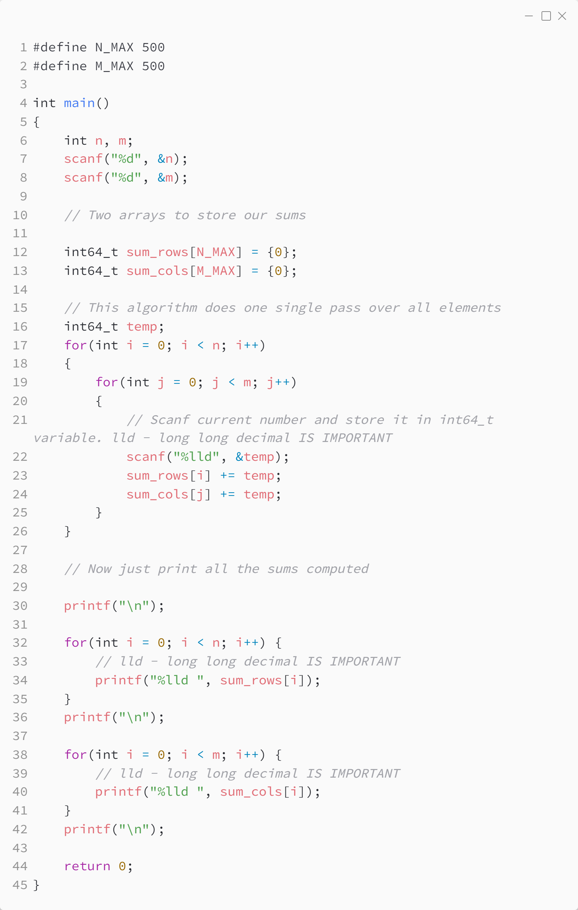

_Практика 1. Тестирование. Работа с массивами._

# Задача 0 - Решение.

Исходный код - [2D_rows_cols_sum.c](../src/2D_rows_cols_sum.c)

### Исходный код программы:

[<](7.md) | [plan](../practice.md) | [>](9.md)
