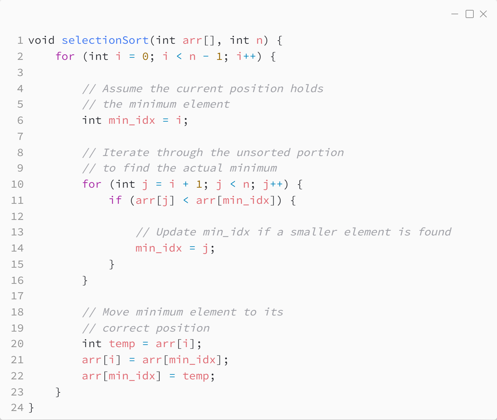

_Практика 2. Сортировки, часть 1. Рекурсия._

# Cекция 0 - Selection Sort.

## Цели секции:

1. Изучить алгоритм Selection Sort

## Характеристики алгоритма

**Time Complexity**: `O(n^2)` ,as there are two nested loops:
* One loop to select an element of Array one by one = `O(n)`
* Another loop to compare that element with every other Array element = `O(n)`
* Therefore overall complexity = O(n) * O(n) = O(n*n) = `O(n2)`

**Auxiliary Space**: `O(1)` as the only extra memory used is for temporary variables.

## Реализация алгоритма

Исходный код - [selection_sort.c](../src/selection_sort.c)

### Исходный код программы:

## Ссылки

https://www.geeksforgeeks.org/selection-sort-algorithm-2/

[plan](../practice.md) | [>](1.md)
