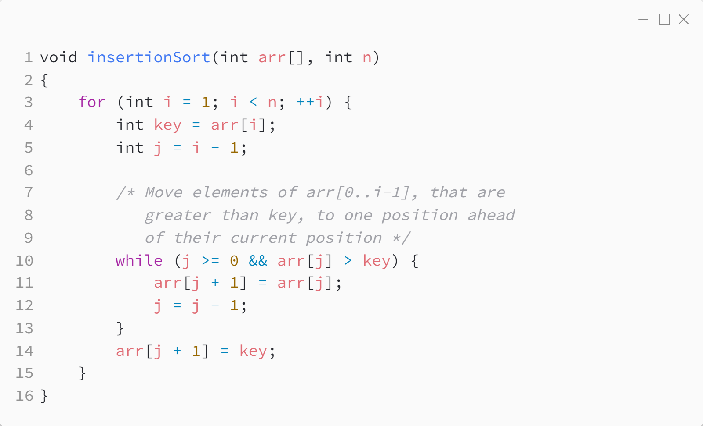

_Практика 2. Сортировки, часть 1. Рекурсия._

# Cекция 1 - Insertion Sort.

## Цели секции:

1. Изучить алгоритм Insertion Sort

## Характеристики алгоритма

### Time Complexity of Insertion Sort
* **Best case**: `O(n)`, If the array is already sorted, where n is the number of elements in the array.
* **Average case**: `O(n^2)`, If the array is randomly ordered
* **Worst case**: `O(n^2)`, If the array is in reverse order
### Space Complexity of Insertion Sort
**Auxiliary Space**: `O(1)`, Insertion sort requires O(1) additional space, making it a space-efficient sorting algorithm.

## Реализация алгоритма

Исходный код - [insertion_sort.c](../src/insertion_sort.c)

### Исходный код программы:

## Ссылки

https://www.geeksforgeeks.org/insertion-sort-algorithm/

[<](0.md) | [plan](../practice.md) | [>](2.md)
