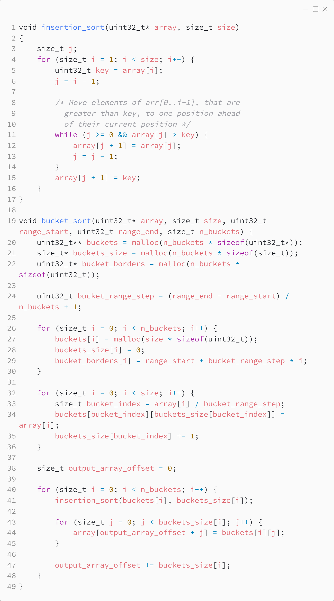

_Практика 2. Сортировки, часть 1. Рекурсия._

# Cекция 4 - Bucket Sort.

## Цели секции:

1. Изучить алгоритм Bucket Sort

## Характеристики алгоритма

**Worst Case Time Complexity**: `O(n^2)`


**Best Case Time Complexity**: `O(n + k)`

**Auxiliary Space**: `O(n+k)`

## Реализация алгоритма

Исходный код - [bucket_sort.c](../src/bucket_sort.c)

### Исходный код программы:


### Зависимость скорости работы от bucket count

```
test time 1 bucket
range 0-1000, 10 iterations, executed in 0.232848 seconds

test time 2 bucket
range 0-1000, 10 iterations, executed in 0.125513 seconds

test time 4 bucket
range 0-1000, 10 iterations, executed in 0.064828 seconds
```

## Ссылки

https://www.geeksforgeeks.org/bucket-sort-2/

[<](3.md) | [plan](../practice.md) | [>](5.md)
