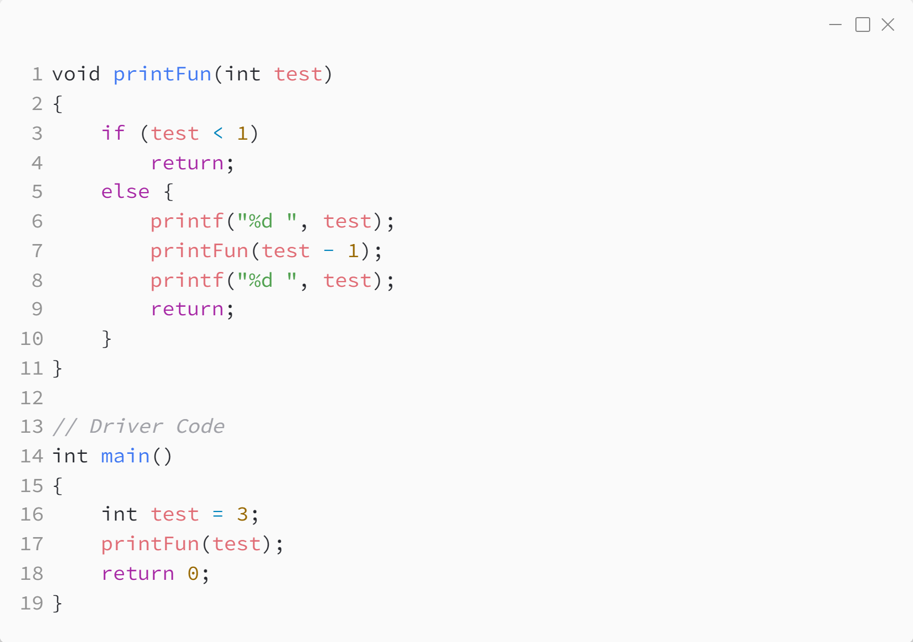

_Практика 2. Сортировки, часть 1. Рекурсия._

# Cекция 6 - Рекурсия.

## Цели секции:

1. Изучить принципы работы рекурсивных функций

## Простой пример

Исходный код - [recursive_factorial.c](../src/recursive_factorial.c)

### Исходный код программы:

## Стек вызова

Исходный код - [recursive_callstack.c](../src/recursive_callstack.c)

### Исходный код программы:

### Стек вызова функций:

## Ссылки

* https://www.geeksforgeeks.org/introduction-to-recursion-2/
* https://habr.com/ru/articles/337030/

[<](5.md) | [plan](../practice.md)
