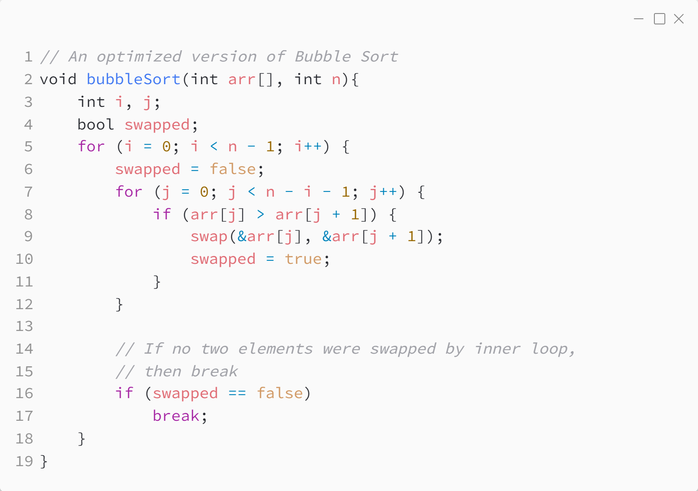

_Практика 2. Сортировки, часть 1. Рекурсия._

# Cекция 2 - Bubble Sort.

## Цели секции:

1. Изучить алгоритм Bubble Sort

## Характеристики алгоритма

**Time Complexity**: `O(n^2)`

**Auxiliary Space**: `O(1)`

## Реализация алгоритма

Исходный код - [bubble_sort.c](../src/bubble_sort.c)

### Исходный код программы:

## Ссылки

https://www.geeksforgeeks.org/bubble-sort-algorithm/

[<](1.md) | [plan](../practice.md) | [>](3.md)
