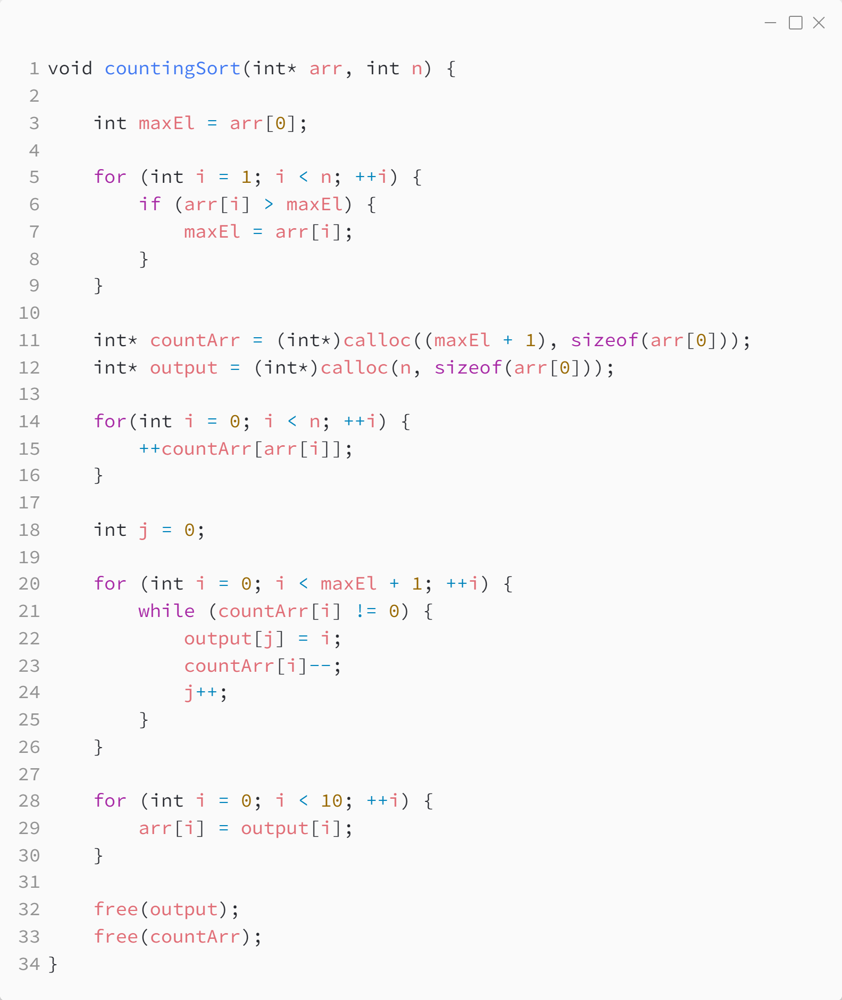

_Практика 2. Сортировки, часть 1. Рекурсия._

# Cекция 3 - Counting Sort.

## Цели секции:

1. Изучить алгоритм Counting Sort

## Характеристики алгоритма

**Time Complexity**: `O(N+M)`, where N and M are the size of `inputArray[]` and `countArray[]` respectively.

**Auxiliary Space**: `O(N+M)`, where N and M are the space taken by `outputArray[]` and `countArray[]` respectively.

## Реализация алгоритма

Исходный код - [counting_sort.c](../src/counting_sort.c)

### Исходный код программы:

## Ссылки

https://www.geeksforgeeks.org/counting-sort/

[<](2.md) | [plan](../practice.md) | [>](4.md)
