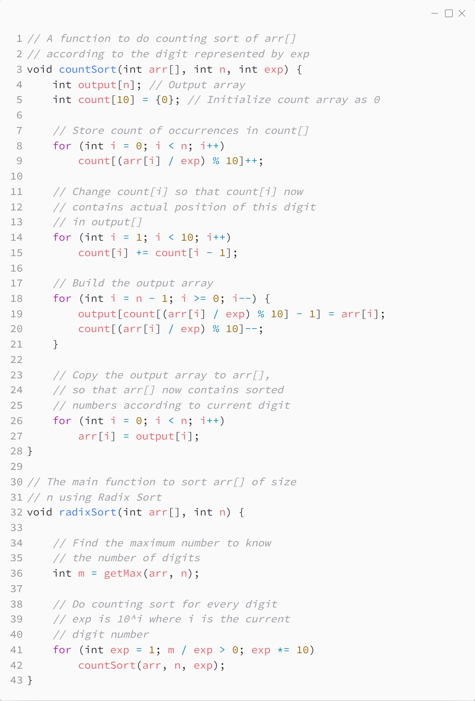

_Практика 2. Сортировки, часть 1. Рекурсия._

# Cекция 5 - Radix Sort.

## Цели секции:

1. Изучить алгоритм Radix Sort

## Характеристики алгоритма

**Time Complexity**: `O(d * (n + b))`, where `d` is the number of digits, `n` is the number of elements, and `b` is the base of the number system being used.

**Auxiliary Space**: `O(n + b)`, where `n` is the number of elements and `b` is the base of the number system.

## Реализация алгоритма

Исходный код - [radix_sort.c](../src/radix_sort.c)

### Исходный код программы:

## Ссылки

https://www.geeksforgeeks.org/radix-sort/

[<](4.md) | [plan](../practice.md) | [>](6.md)
