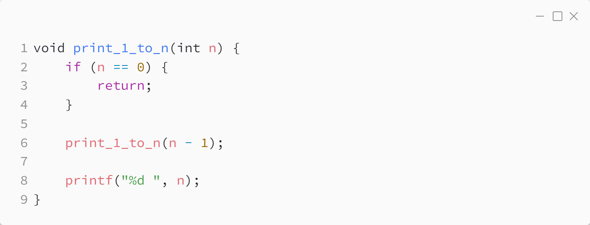
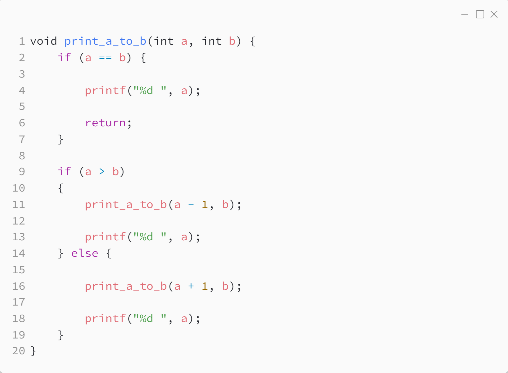
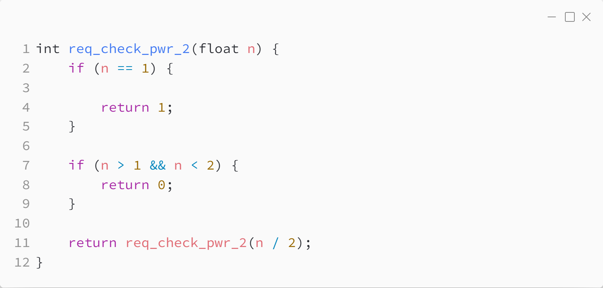
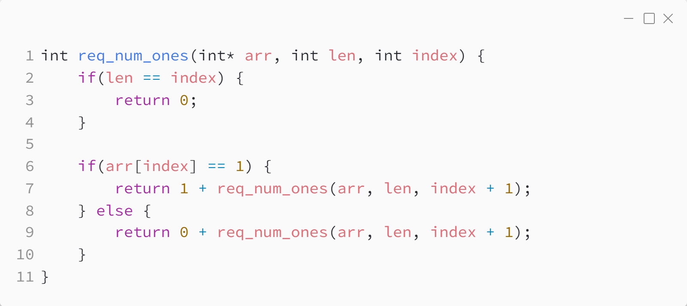
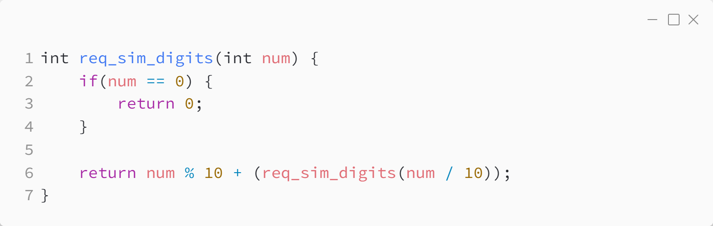
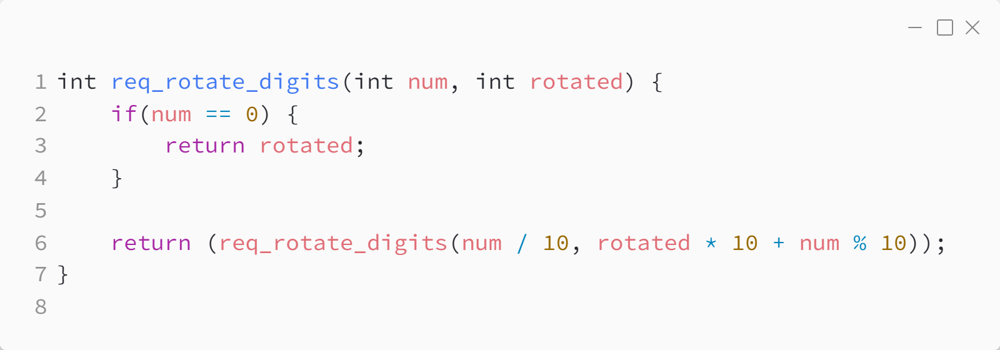

_Практика 3. Сортировки, часть 2. Рекурсия._

# Cекция 0 - Простые задачи с использованием рекурсии.

## Цели секции:

1. Изучить возможные применения рекурсии на примерах

## Задача 0
### Формулировка задачи

Дано натуральное число n. Выведите все числа от 1 до n.

### Реализация алгоритма

Исходный код - [req_1_to_n.c](../src/req_1_to_n.c)

### Исходный код программы:

## Задача 1
### Формулировка задачи

Даны два целых числа A и В. Выведите все числа от A до B включительно, в порядке возрастания, если A < B, или в порядке убывания в противном случае.

### Реализация алгоритма

Исходный код - [req_a_to_b.c](../src/req_a_to_b.c)

### Исходный код программы:

## Задача 2
### Формулировка задачи

Дано натуральное число N. Проверить, является ли это число степенью двойки.

### Реализация алгоритма

Исходный код - [req_check_pwr_2.c](../src/req_check_pwr_2.c)

### Исходный код программы:

## Задача 3
### Формулировка задачи

Дан массив целых чисел. Подсчитать количество единиц в массиве.

### Реализация алгоритма

Исходный код - [req_num_ones.c](../src/req_num_ones.c)

### Исходный код программы:

## Задача 4
### Формулировка задачи

Вычислить сумму цифр в числе.

### Реализация алгоритма

Исходный код - [req_sum_digits.c](../src/req_sum_digits.c)

### Исходный код программы:

## Задача 5
### Формулировка задачи

Из данного числа сформировать число, состоящее из тех же цифр, но идущих в обратном порядке.

### Реализация алгоритма

Исходный код - [req_rotate_digits.c](../src/req_rotate_digits.c)

### Исходный код программы:

## Ссылки

https://habr.com/ru/articles/275813/

[plan](../practice.md) | [>](1.md)
