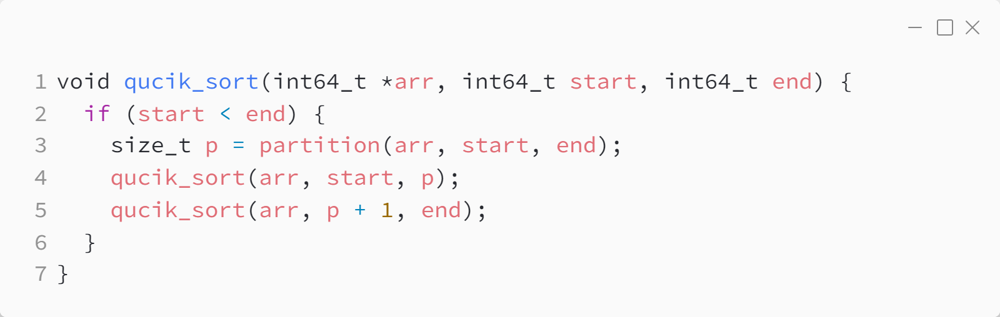
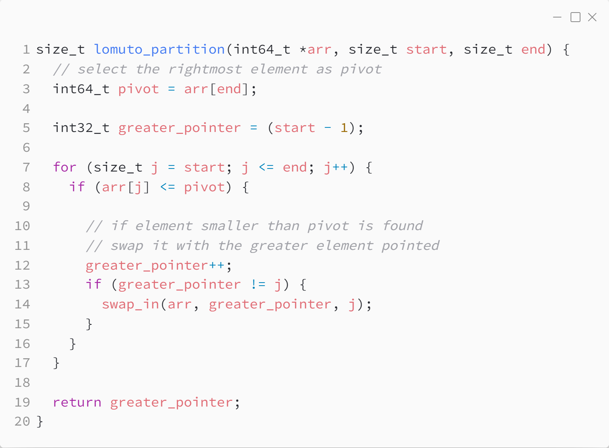
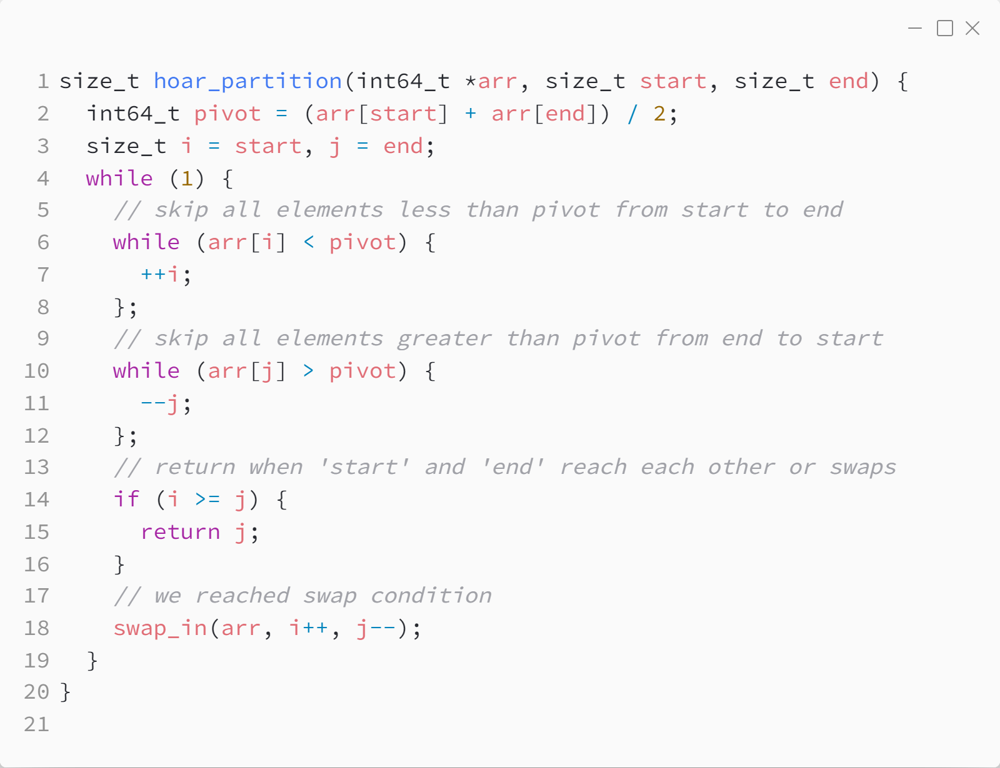

_Практика 3. Сортировки, часть 2. Рекурсия._

# Cекция 2 - Quick Sort.

## Цели секции:

1. Изучить алгоритм Quick Sort
2. Изучить Lomuto partition
2. Изучить Hoar partition

## Характеристики алгоритма

Характеристики алгоритма зависят от выбранного разделения.

## Реализация алгоритма
### Исходный код программы:

## Lomuto partition

### Характеристики алгоритма
* **Time Complexity**: `O(n)`
* **Auxiliary Space**: `O(1)`

### Реализация алгоритма

Исходный код - [qsort_lomuto.c](../src/qsort_lomuto.c)

### Исходный код программы:

## Hoar partition

### Характеристики алгоритма
* **Time Complexity**: `O(n)`
* **Auxiliary Space**: `O(1)`

### Реализация алгоритма

Исходный код - [qsort_hoar.c](../src/qsort_hoar.c)

### Исходный код программы:

## Ссылки

* https://www.geeksforgeeks.org/quick-sort-algorithm/
* https://www.geeksforgeeks.org/lomuto-partition-algorithm/
* https://www.geeksforgeeks.org/hoare-s-partition-algorithm/

[<](1.md) | [plan](../practice.md)
