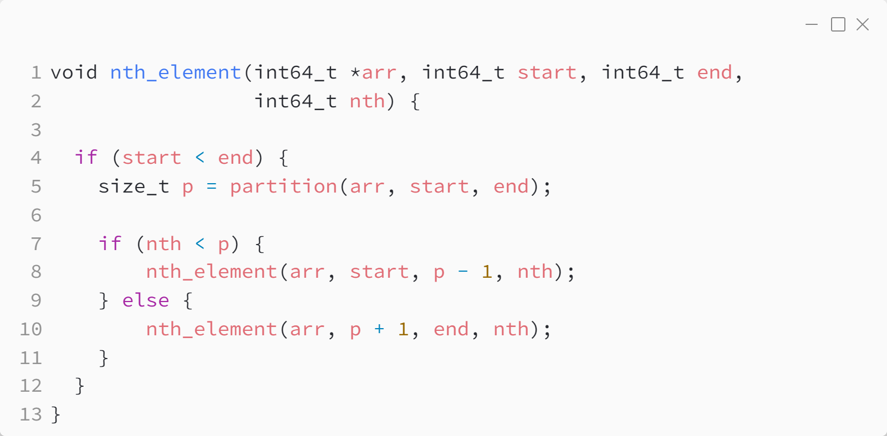

_Практика 3. Сортировки, часть 2. Рекурсия._

# Cекция 4 - Nth element.

## Цели секции:

1. Изучить алгоритм Nth element

## Характеристики алгоритма

Данный алгоритм может быть реализован различными путями. В рамках данной практики рассматривается реализация на основе `qsort`. Существуют реализации на основе `introselect` ("introspective selection"), но они сложны для понимания.

* **Time Complexity**: `O(n)`
* **Auxiliary Space**: `O(1)`

Ассимтотическая сложность алгоритма совпадает с `qsort`, но на практике данный алгоритм будет работать быстрее, чем `qsort`.

## Реализация алгоритма

Исходный код - [nth_element.c](../src/nth_element.c)

### Исходный код программы:

### Результат выполнения программы:

## Ссылки

* https://www.geeksforgeeks.org/stdnth_element-in-cpp/
* https://en.wikipedia.org/wiki/Introselect

[<](4.md) | [plan](../practice.md)
