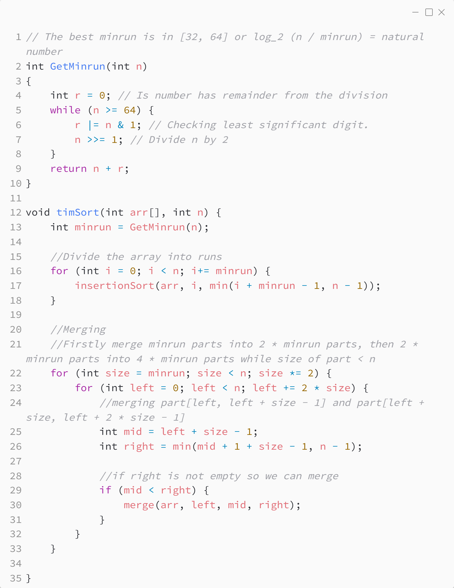

_Практика 3. Сортировки, часть 2. Рекурсия._

# Cекция 3 - Tim Sort.

## Цели секции:

1. Изучить простую версию алгоритма Tim Sort
2. Изучить полную версию алгоритма Tim Sort

## Реализация простой версии алгоритма
### Идея
1. Находим оптимальную длину подмассивов(minrun):\
-Число minrun ограничено сверху, должно быть таким, чтобы алгоритм сортировки вставками был эффективным.\
-Число minrun ограничено снизу, должно быть таким, чтобы алгоритм сортировки слиянием был эффективным.
2. Для подмассивов используем сортировку вставками
3. Собираем отсортированные подмассивы в единый массив с помошью сортировки слиянием

Исходный код - [tim_sort.c](../src/tim_sort.c)

### Исходный код программы:

## Реализация полной версии алгоритма
### Идея
1. Так же находим оптимальную длину подмассивов minrun
2. Разбиваем массив на подмассивы(runs) такие, что:\
-Длина подмассива не меньше minrun\
-Длина может быть больше minrun, если следующие элементы идут упорядоченно так же, как и элементы подмассива(т.е. мы пытаемся найти максимально длинную упорядоченную подпоследовательность, чтобы сортировка вставками работала максимально эффективно)
3. Если получившийся подмассив упорядочен по убыванию — переставляем элементы так, чтобы они шли по возрастанию(за линейное время)
4. Собираем подмассивы, используя сортировку слиянием с модификацией "галоп"

## Характеристики алгоритма

* **Time Complexity**: `O(n*log(n))`
* **Auxiliary Space**: `O(n)`
* **Stable**: `yes`

## Применение

Разработан Тимом Питерсом в 2002 году. Используется в Java SE 7,Android platform, Swift, Python.

## Ссылки

* https://www.geeksforgeeks.org/timsort/
* https://habr.com/ru/companies/infopulse/articles/133303/

[<](2.md) | [plan](../practice.md) | [>](3.md)
