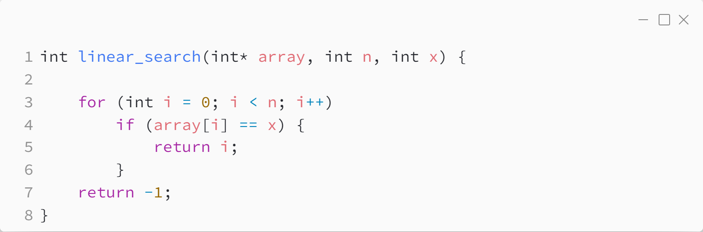
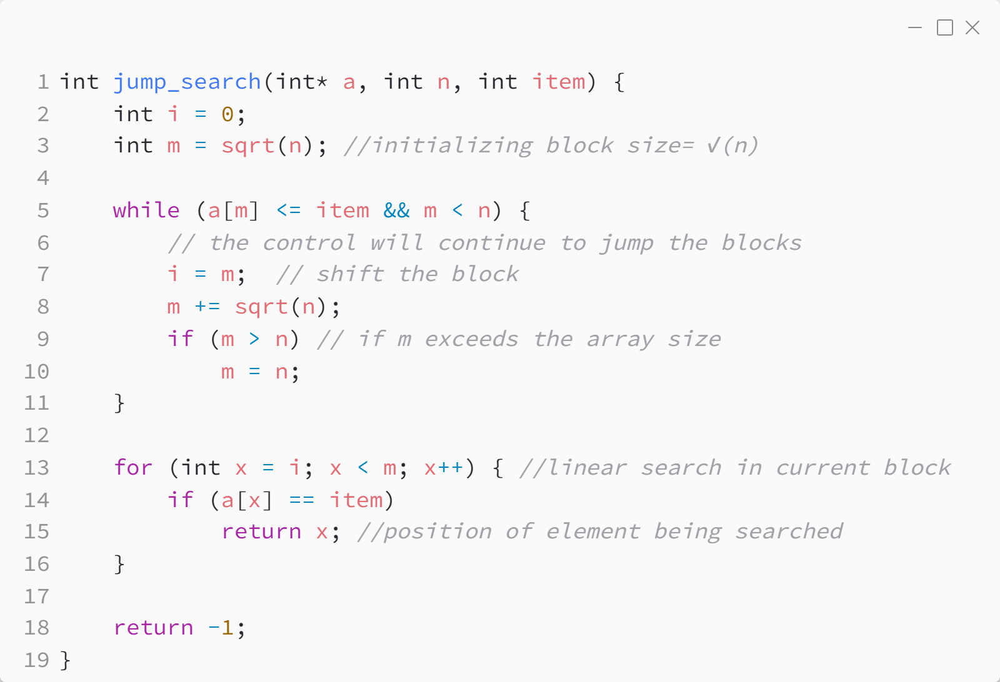

_Практика 4. Поиск элемента в массиве._

# Cекция 0 - Linear search. Jump search.

## Linear search

Исходный код - [linear_search.c](../src/linear_search.c)

### Исходный код программы:

## Jump search

Исходный код - [jump_search.c](../src/jump_search.c)

### Исходный код программы:

[plan](../practice.md) | [>](1.md)
