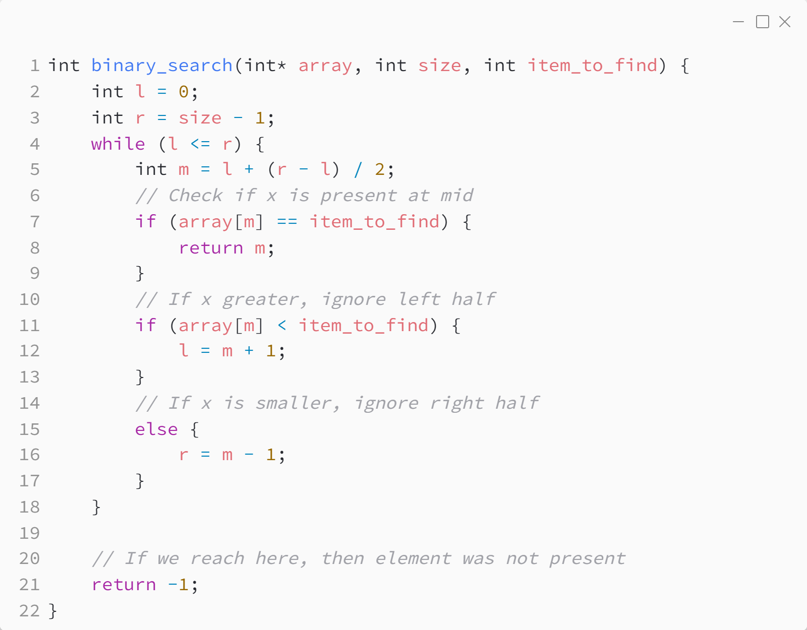
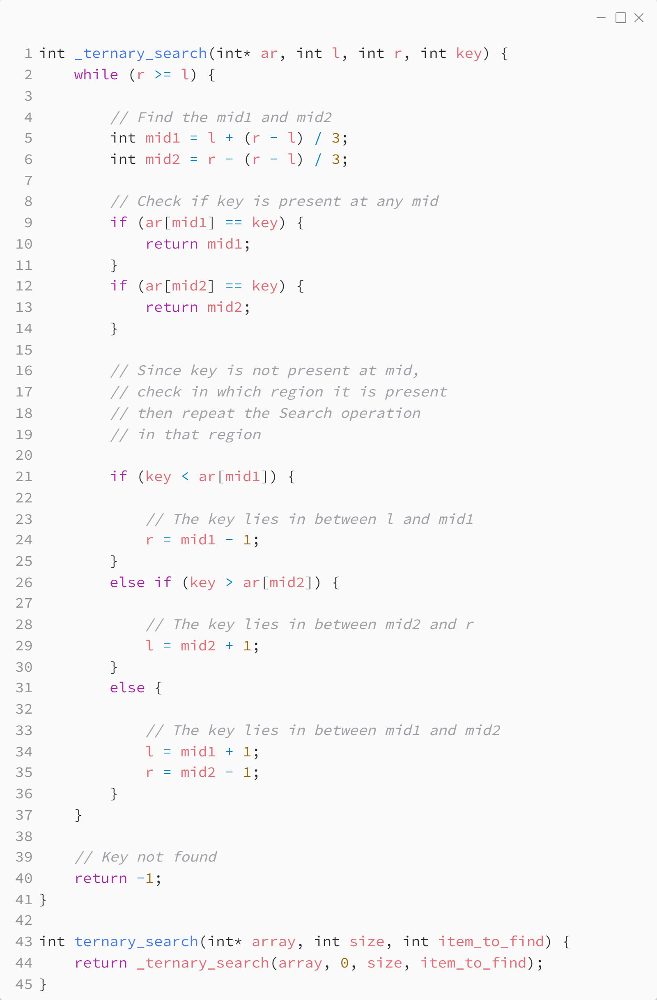

_Практика 4. Поиск элемента в массиве._

# Cекция 1 - Binary search. Ternary search.

## Binary search

Исходный код - [binary_search.c](../src/binary_search.c)

### Исходный код программы:

## Ternary search

Исходный код - [ternary_search.c](../src/ternary_search.c)

### Исходный код программы:

[<](0.md) | [plan](../practice.md) | [>](2.md)
