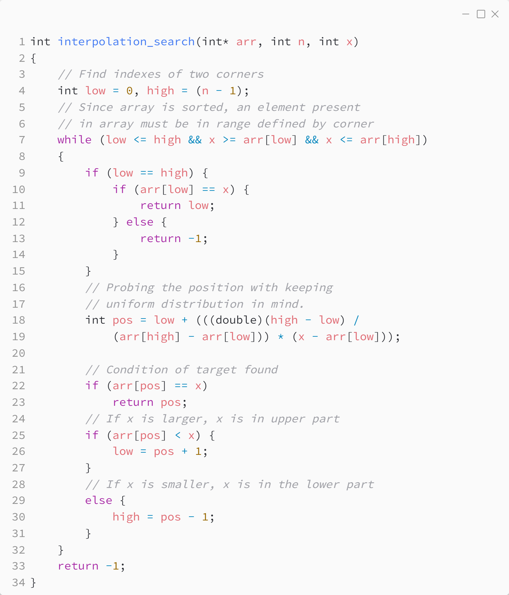

_Практика 4. Поиск элемента в массиве._

# Cекция 3 - Interpolation search.

## Interpolation search

Исходный код - [interpolation_search.c](../src/interpolation_search.c)

### Исходный код программы:

[<](2.md) | [plan](../practice.md) | [>](4.md)
