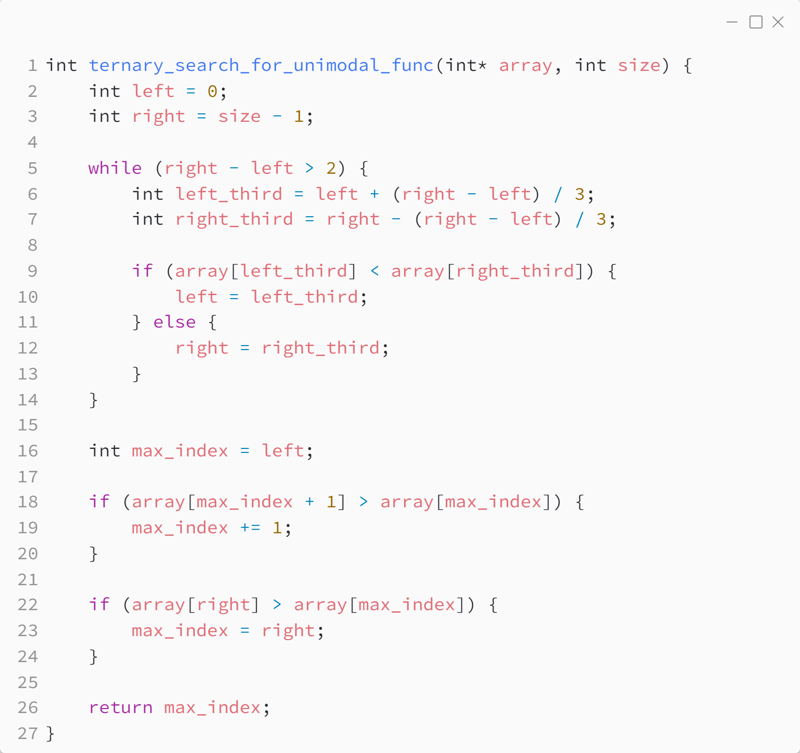
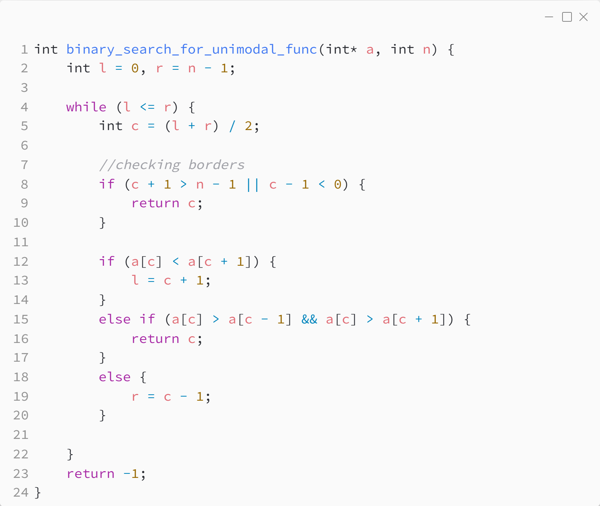

_Практика 4. Поиск элемента в массиве._

# Задача 1 - Решение с помощью тернарного поиска.

Формулировка данной задачи является упрощением задачи о поиске экстремума унимодальной функции одной переменной. Данную задачу можно решить с помощью тернатрного поиска.

Исходный код - [ternary_search_for_unimodal_func.c](../src/ternary_search_for_unimodal_func.c)

### Исходный код программы:

# Задача 1 - Решение с помощью бинарного поиска.

Исходный код - [binary_search_for_unimodal_func.c](../src/binary_search_for_unimodal_func.c)

### Исходный код программы:

[<](7.md) | [plan](../practice.md)
