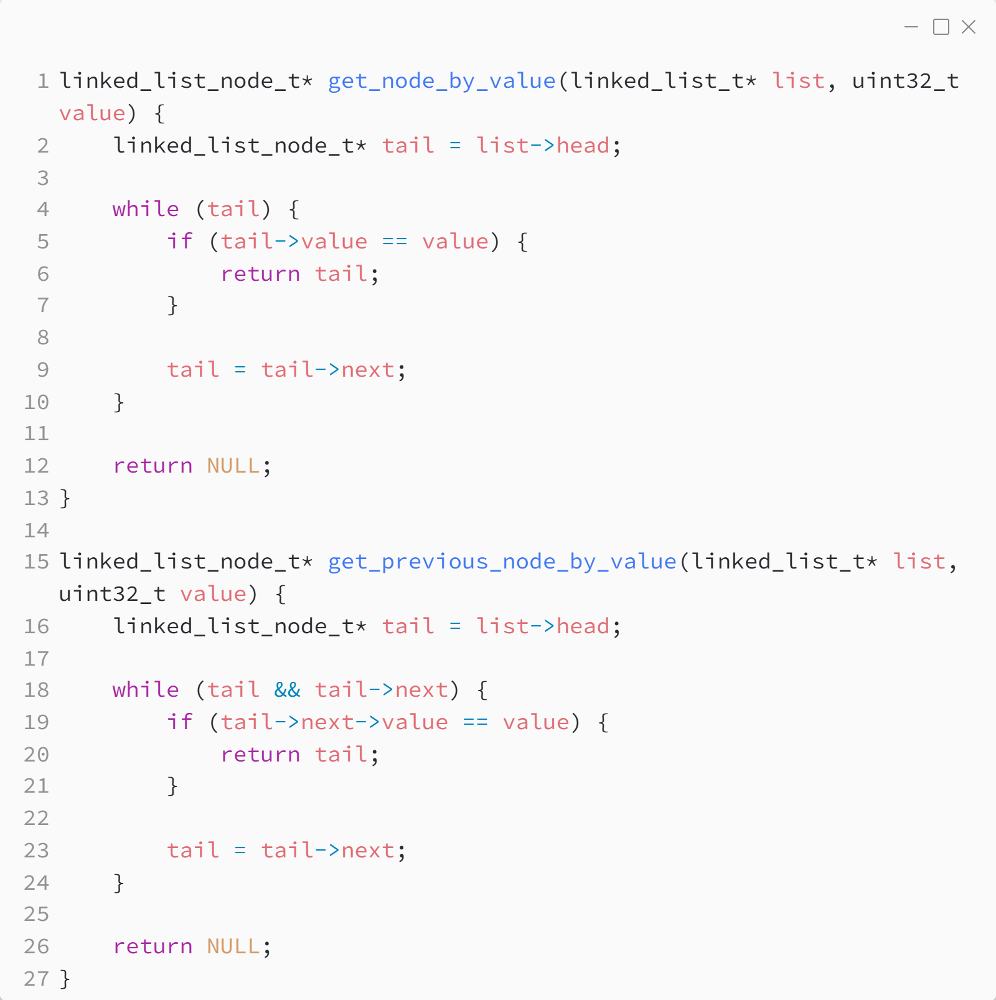

_Практика 5. Простые структуры данных._

# Секция 0 - Linked list.

Исходный код - [linked_list.c](../src/linked_list.c)

### Структура данных:

### Создание и удаление списка:

### Добавление элемента в начало и конец списка:

### Поиск элемента в списке:

### Удаление элемента:

### Добавление элемента после произвольного элемента в списке:

[plan](../practice.md) | [>](1.md)
