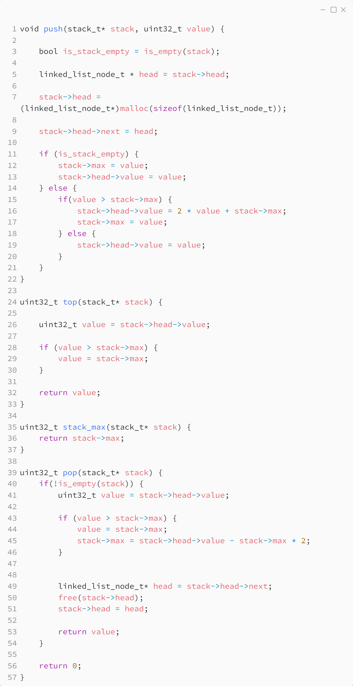

_Практика 6. Простые структуры данных, часть 2._

# Секция 1 - Max stack.

Исходный код - [max_stack.c](../src/max_stack.c)

### Исходный код программы:

## Вопросы
* Как можно реализовать min stack?

[<](0.md) | [plan](../practice.md) | [>](2.md)
