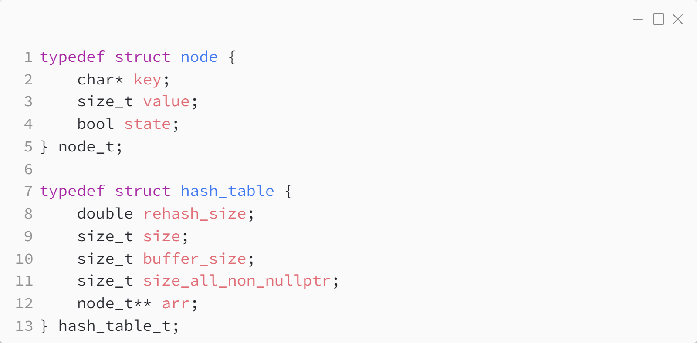
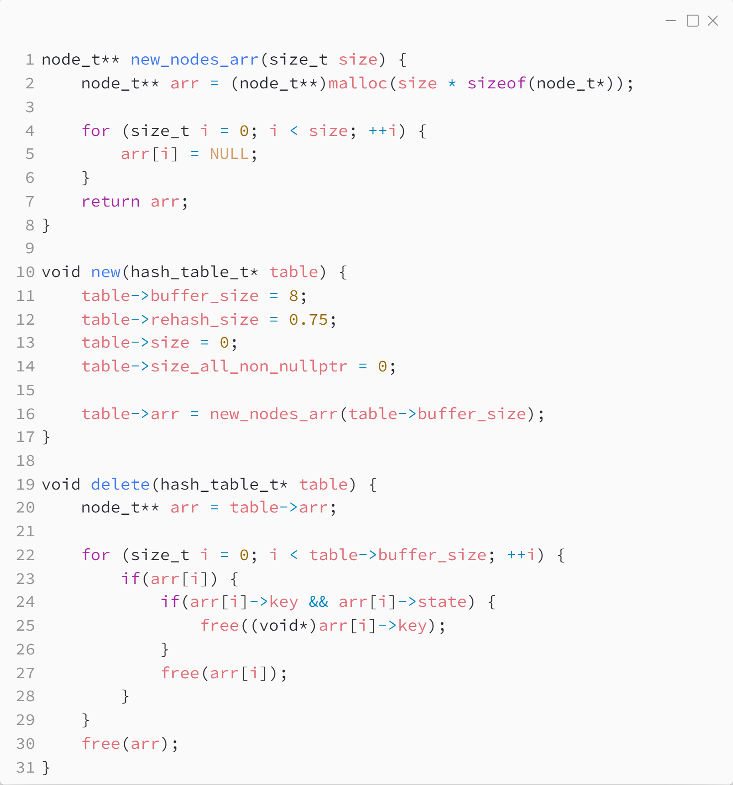
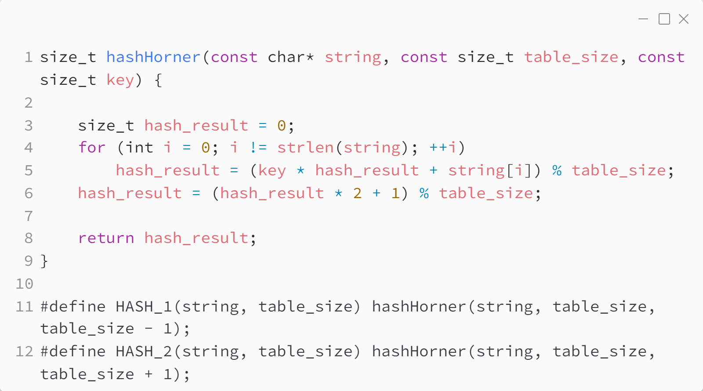
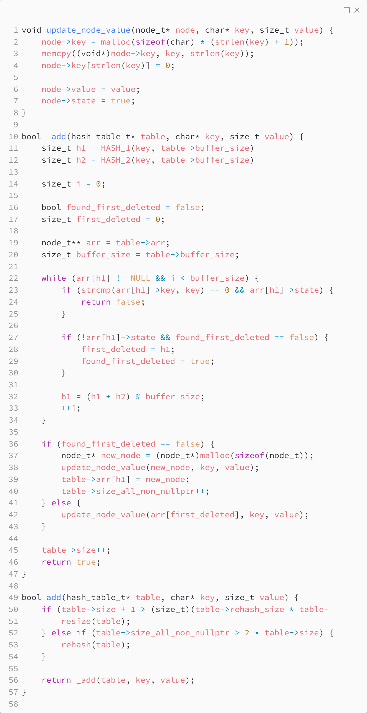
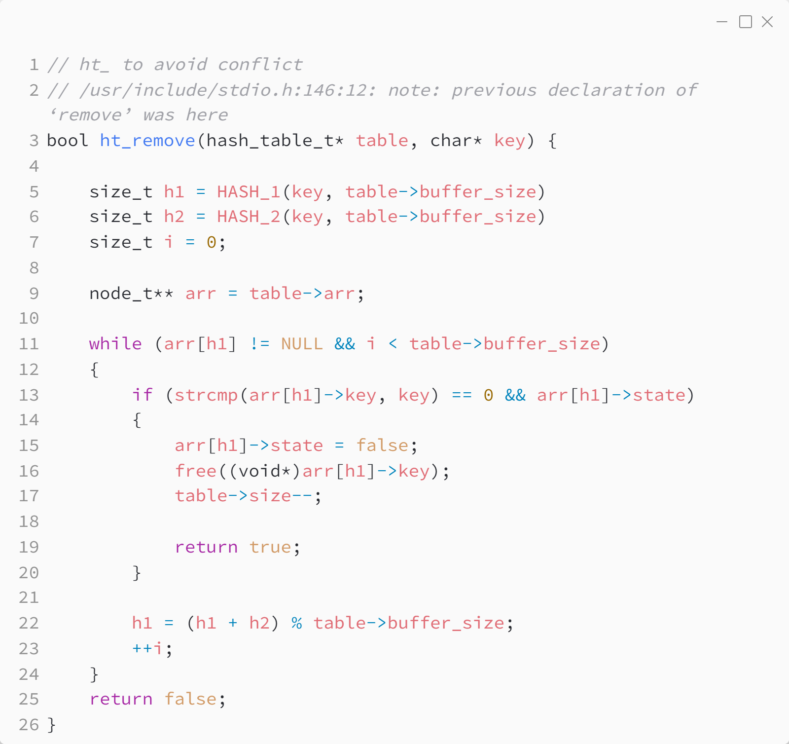
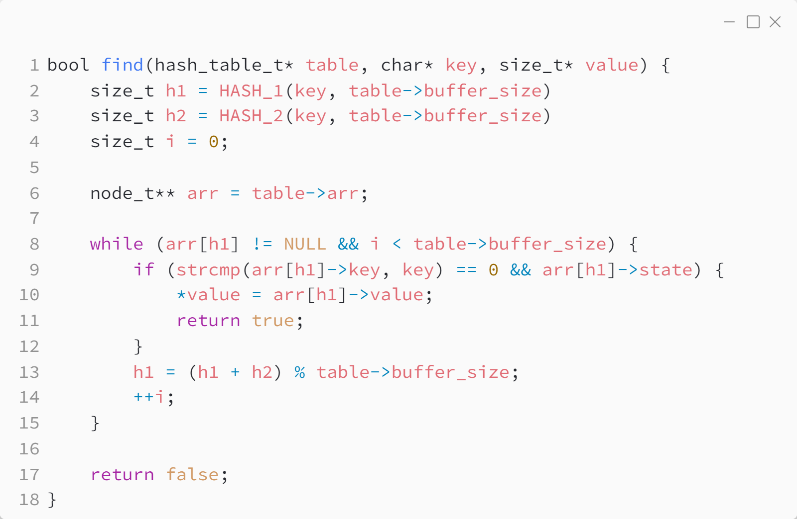
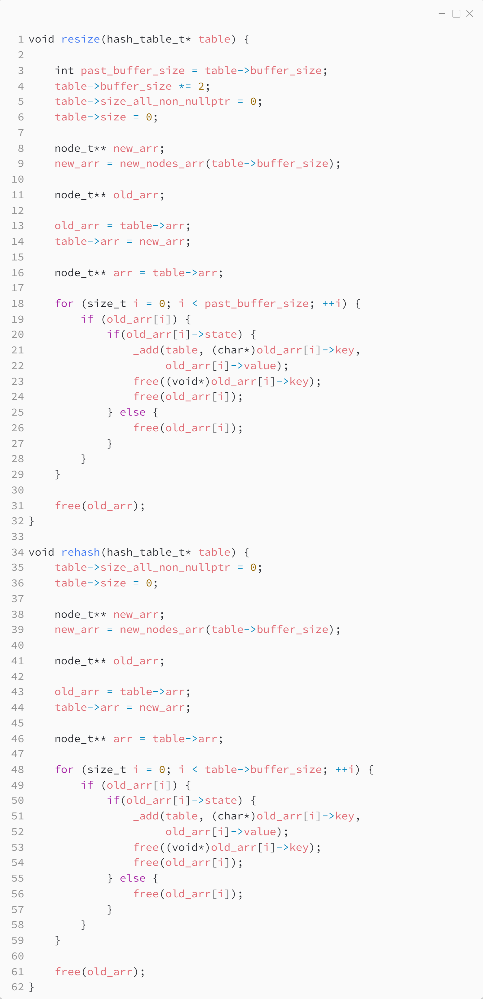
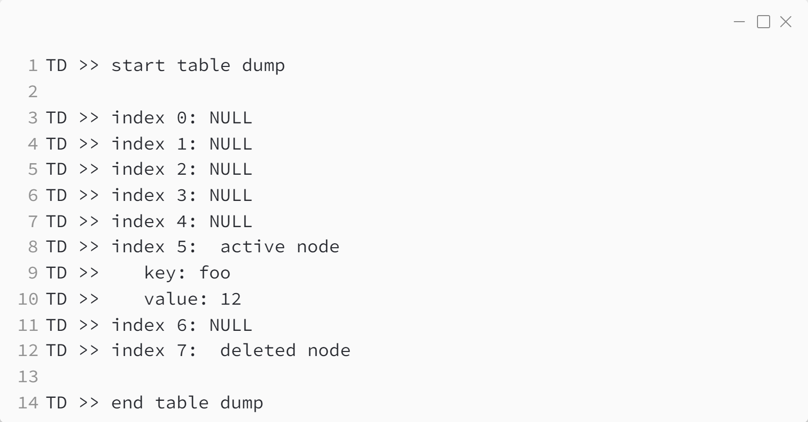

_Практика 6. Простые структуры данных, часть 2._

# Секция 2 - Hash table.

Исходный код - [hash_table.c](../src/hash_table.c)

## Исходный код программы:

### Структуры данных

### Создание и удаление

### Хеширование

### Добавление элемента

### Удаление элемента

### Поиск элемента

### Resize and rehash

## Пример внутреннего состояния структуры данных

[<](1.md) | [plan](../practice.md)
