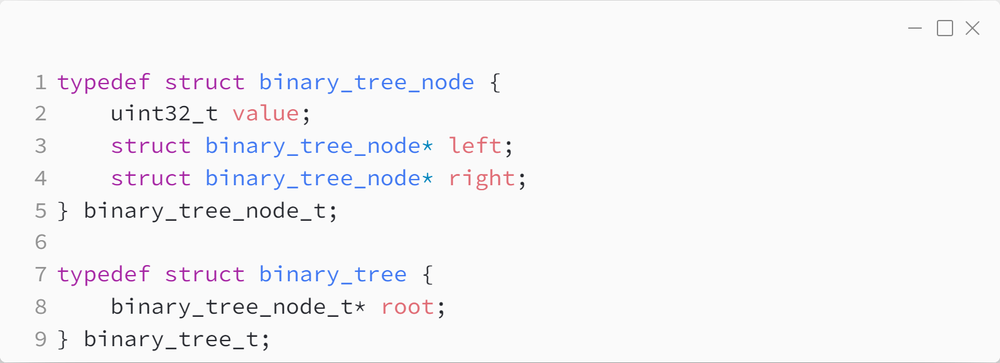
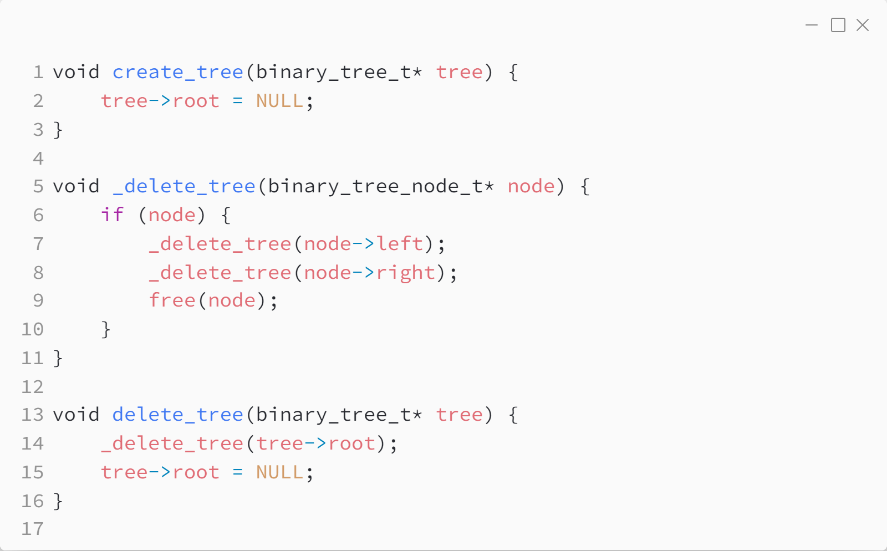
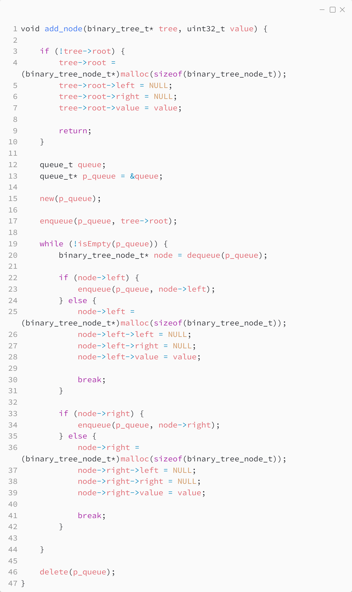
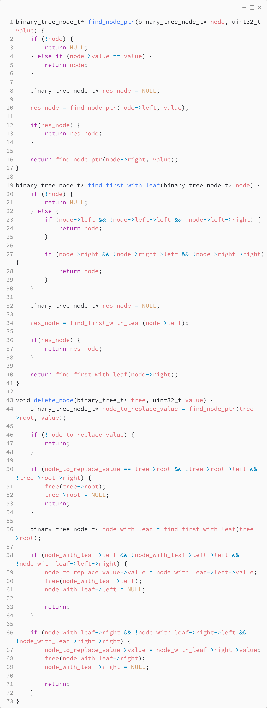
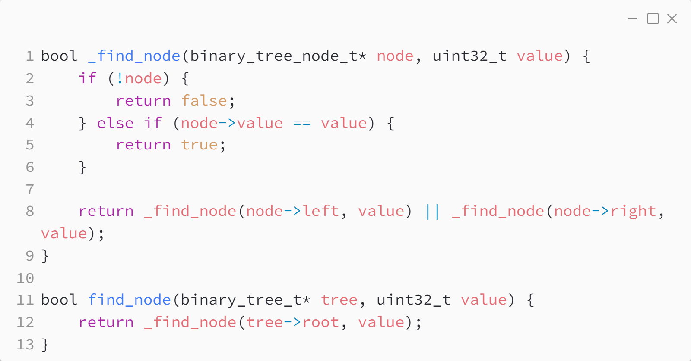
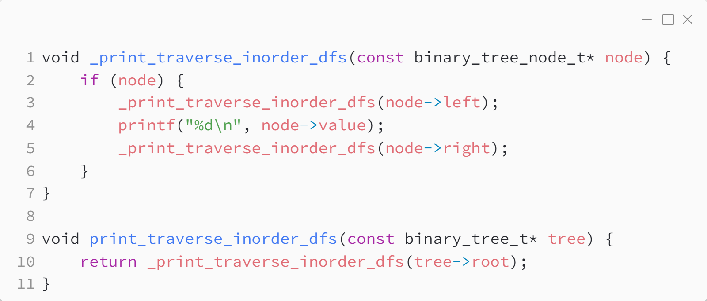

_Практика 7. Binary heap._

# Секция 0 - Binary tree.

Исходный код - [binary_tree.c](../src/binary_tree.c)

## Структуры данных

## Создание и удаление

## Добавление элемента

## Удаление элемента

## Поиск элемента

## Обход дерева

> Более подробно про обход бинарного дерева будет рассказано в следующих практиках.

[plan](../practice.md) | [>](1.md)
