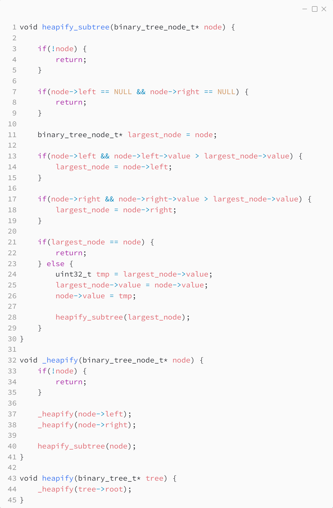

_Практика 7. Binary heap._

# Секция 0 - Binary heap on binary tree.

Исходный код - [heap_tree.c](../src/heap_tree.c)

## Восстановление свойства кучи



## Получение максимума


## Результаты измерения производительности
Приведено суммарное время 1000 построений бинарной кучи из 10 элементов (10 вызовов функции `add_node` + 1 вызов функции `heapify`)
```
1000 heap creations executed in 0.001153 seconds
```

[<](0.md) | [plan](../practice.md) | [>](2.md)
