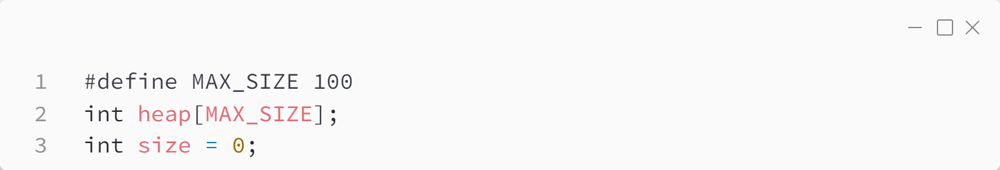
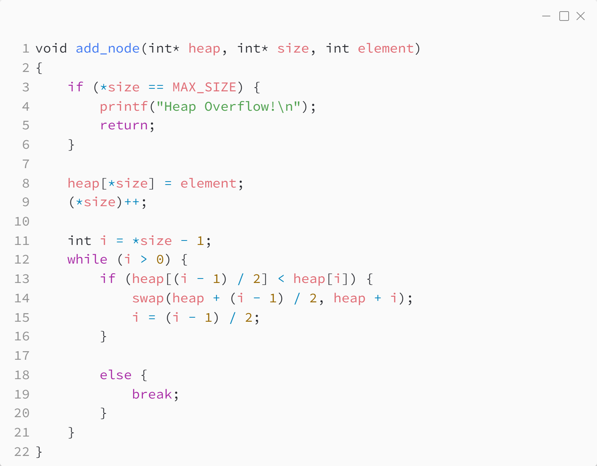
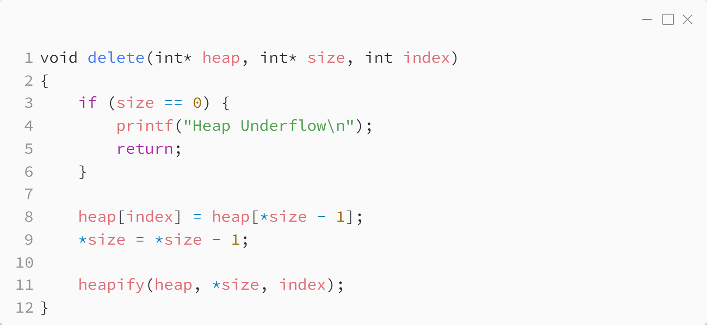
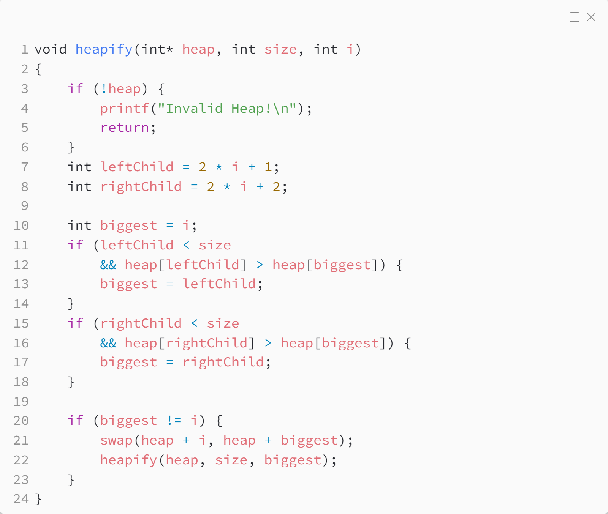
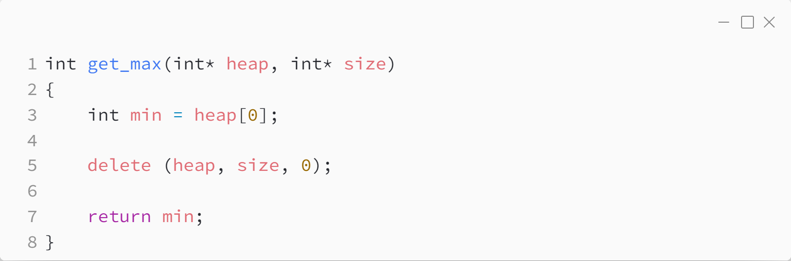

_Практика 7. Binary heap._

# Секция 2 - Binary heap on array.

Исходный код - [heap_array.c](../src/heap_array.c)

## Структуры данных



## Добавление элемента



## Удаление элемента



## Восстановление свойства кучи



## Получение максимума



## Результаты измерения производительности
Приведено суммарное время 1000 построений бинарной кучи из 10 элементов (10 вызовов функции `add_node` + 10 вызов функции `heapify`)
```
1000 heap creations executed in 0.000167 seconds
```

[<](1.md) | [plan](../practice.md) | [>](3.md)
