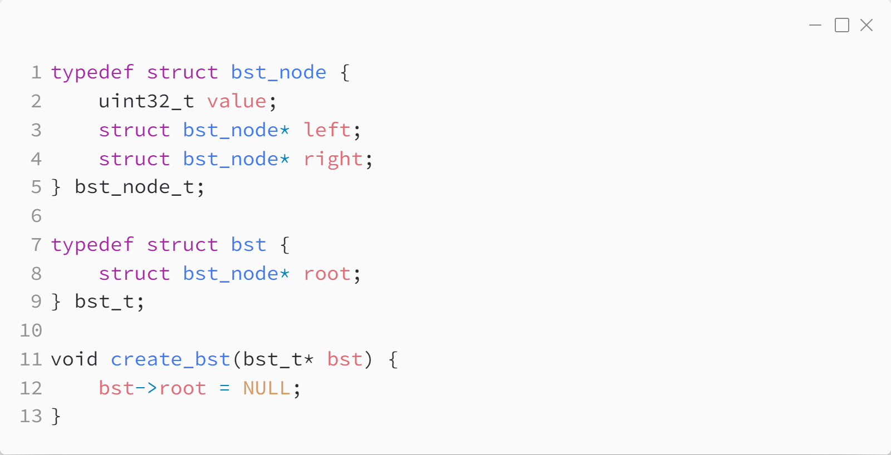
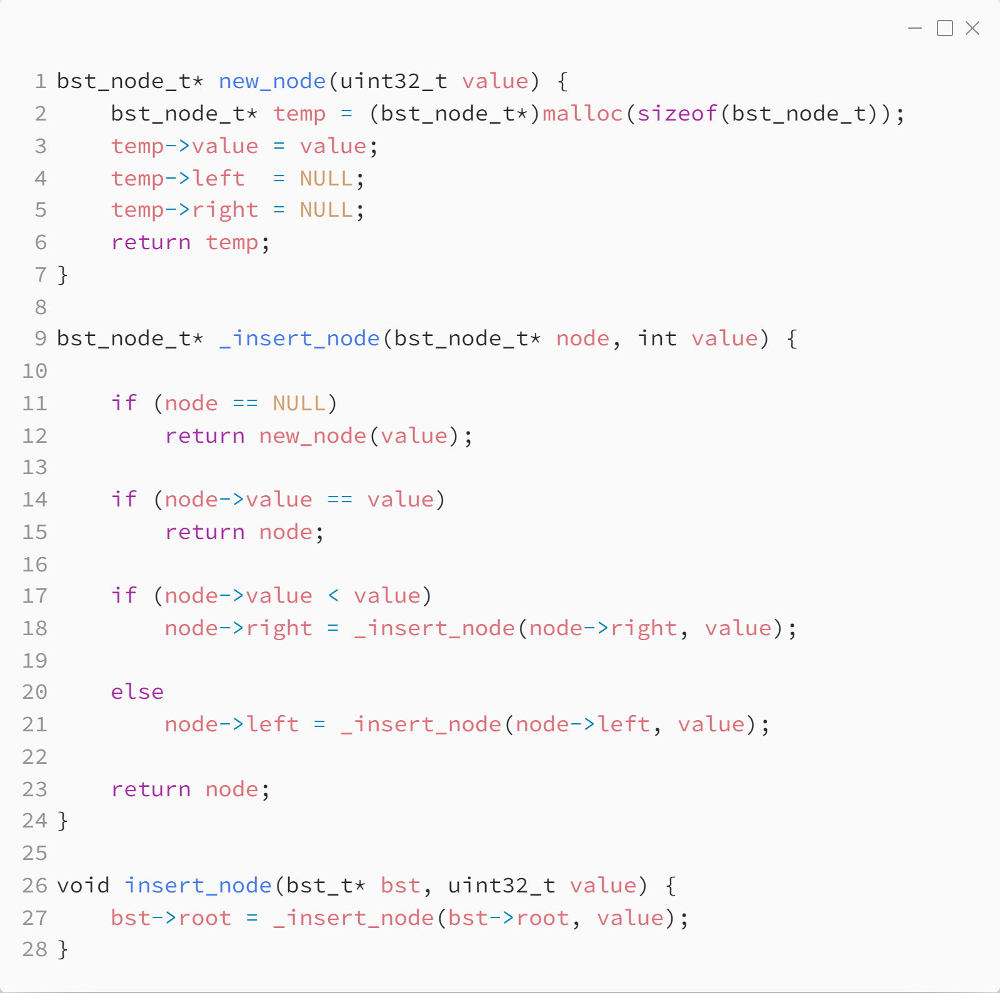
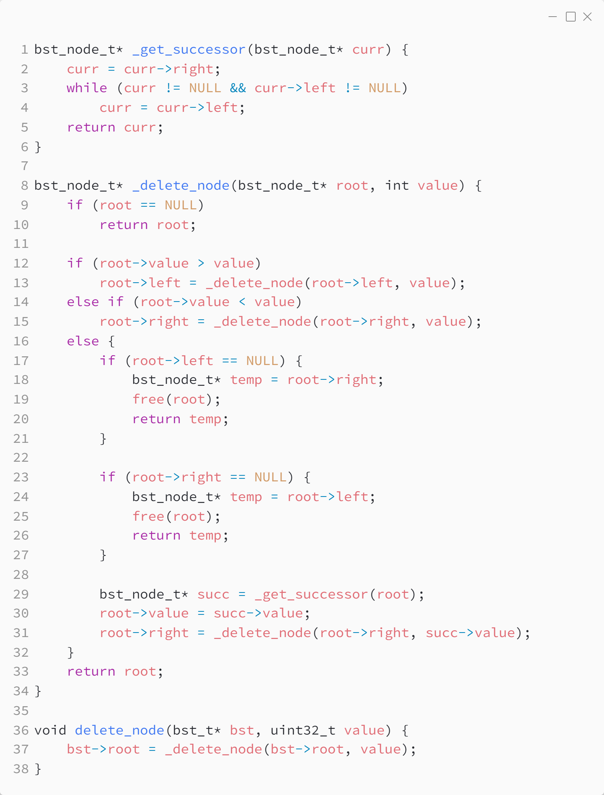
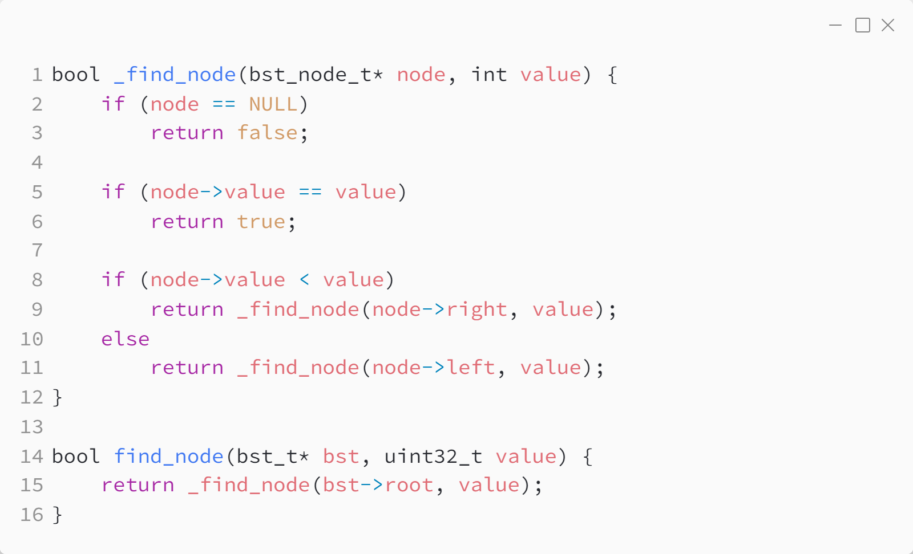
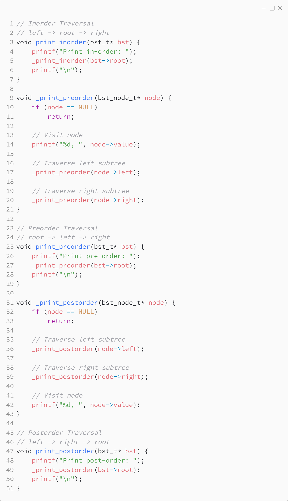

_Практика 8. Бинарные деревья поиска._

Исходный код - [bst.c](../src/bst.c)

### Структуры данных:

### Создание и удаление дерева поиска:

### Добавление элемента:

### Удаление элемента:

### Поиск элемента:

### Обход дерева:

[plan](../practice.md) | [>](1.md)
