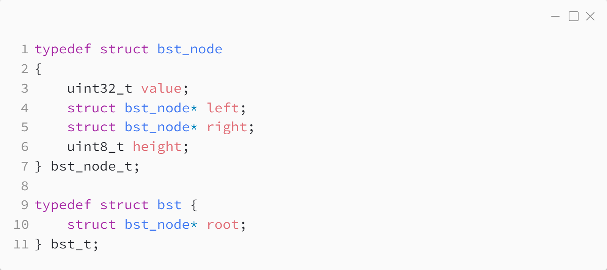
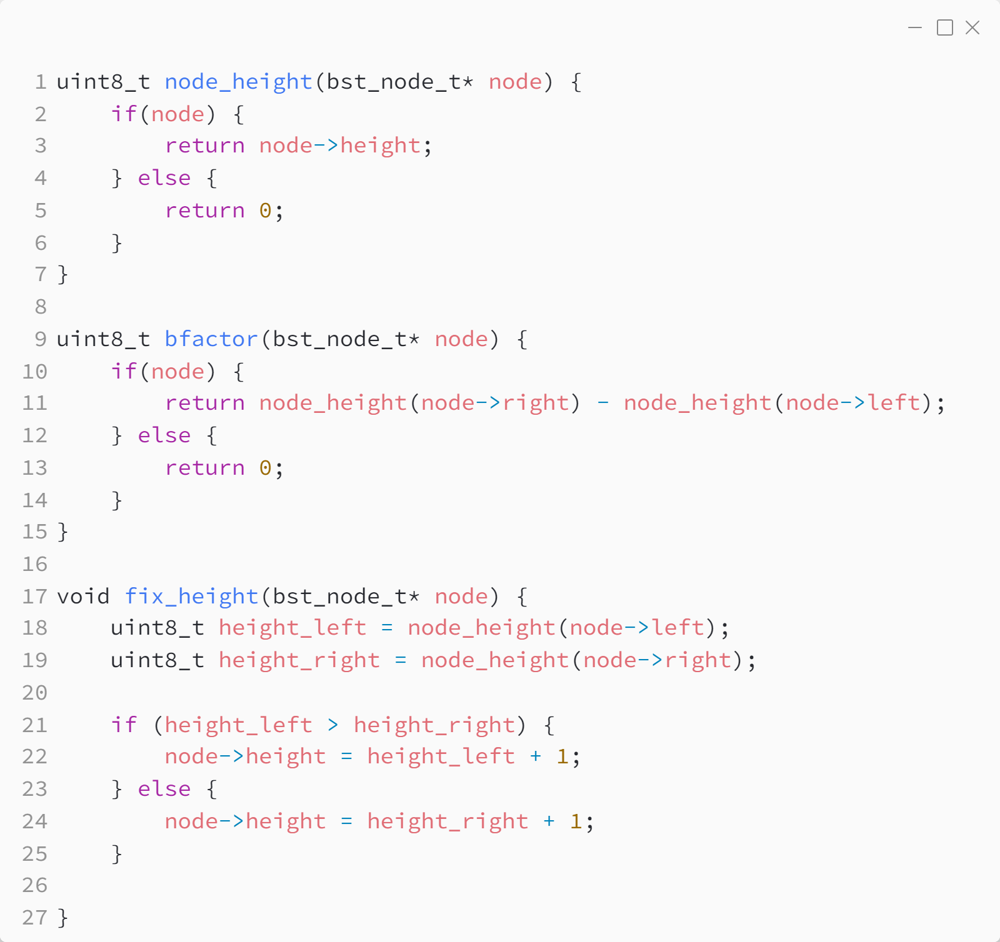
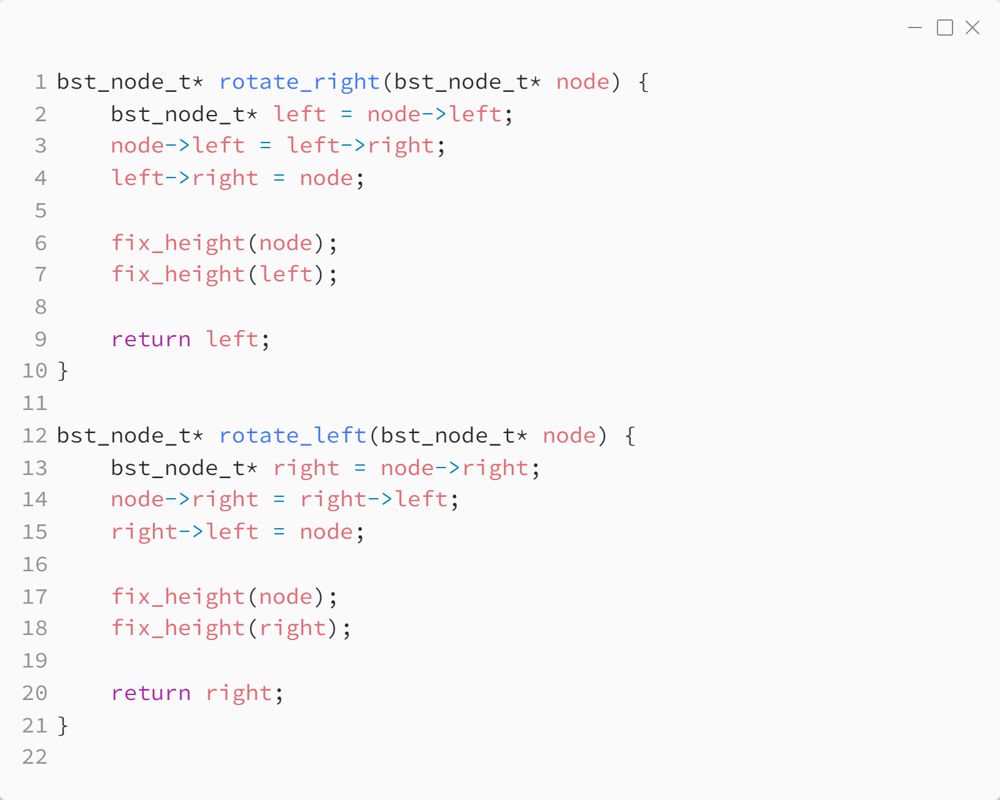
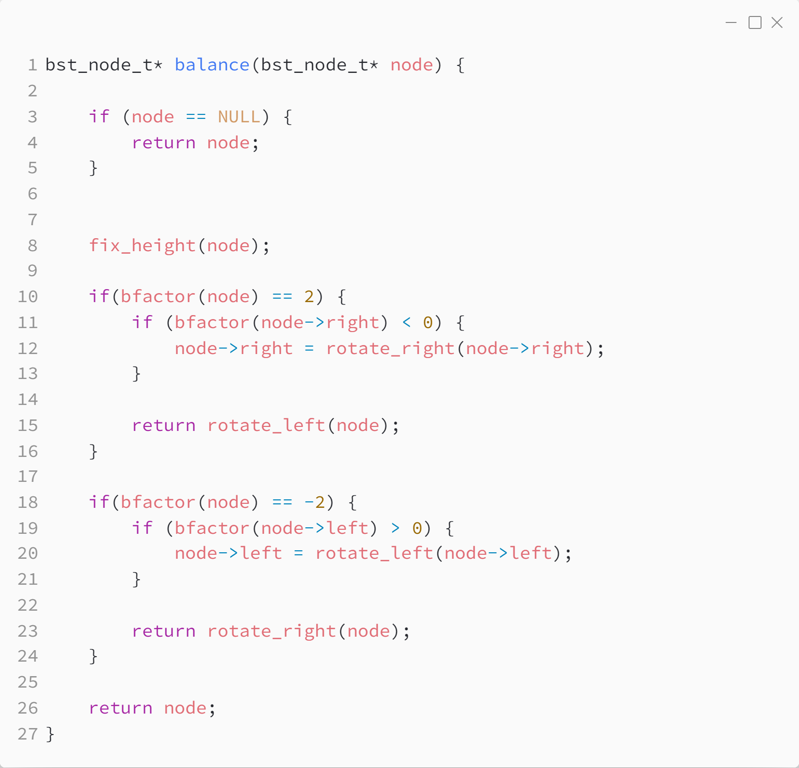
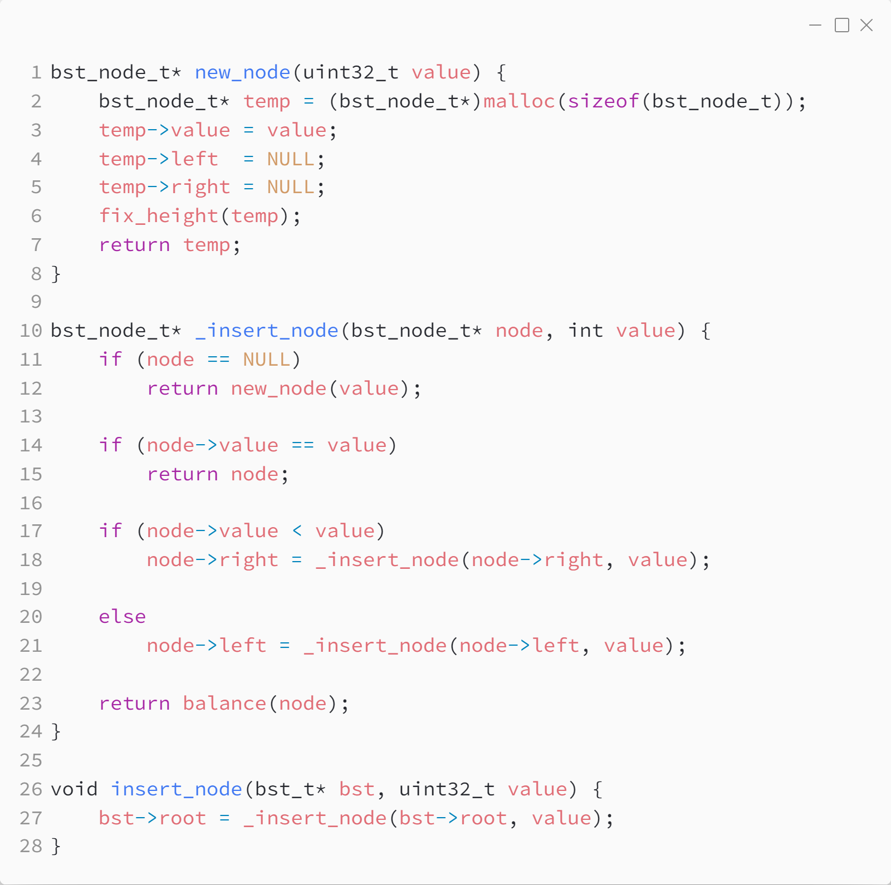
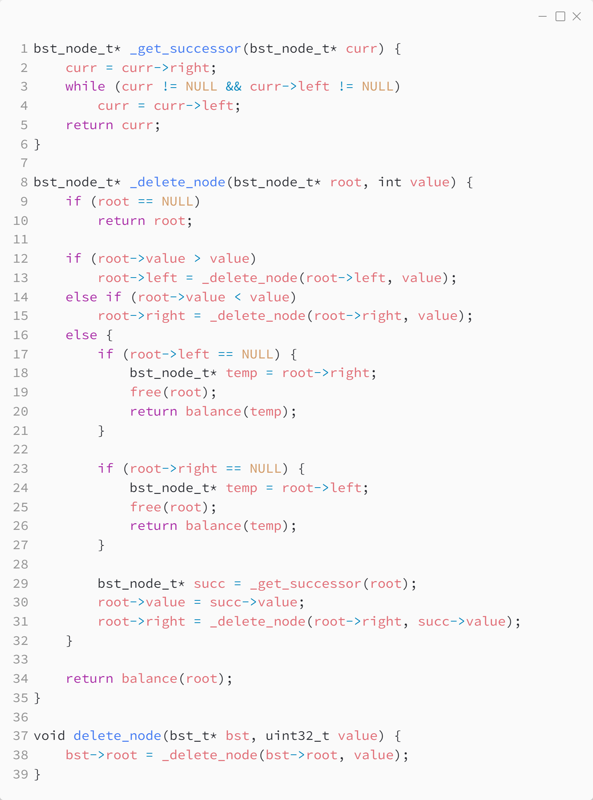

_Практика 8. Бинарные деревья поиска._

Исходный код - [bst_avl.c](../src/bst_avl.c)

### Структуры данных:

### Вспомогательные функции:

### Повороты:

### Балансировка:

### Добавление элемента:

### Удаление элемента:

[<](0.md) | [plan](../practice.md)
