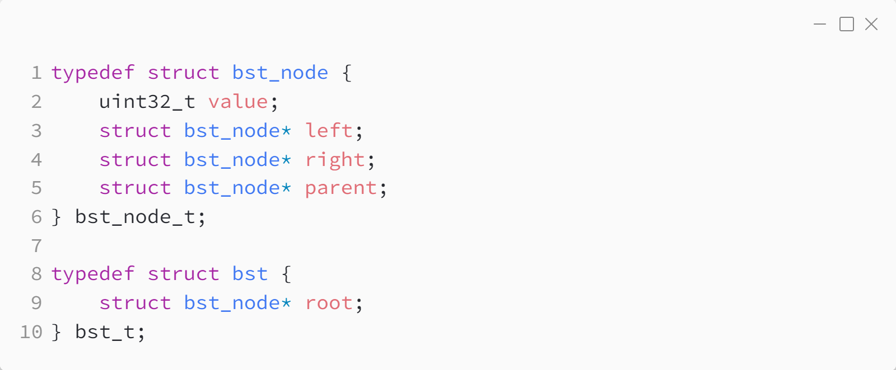
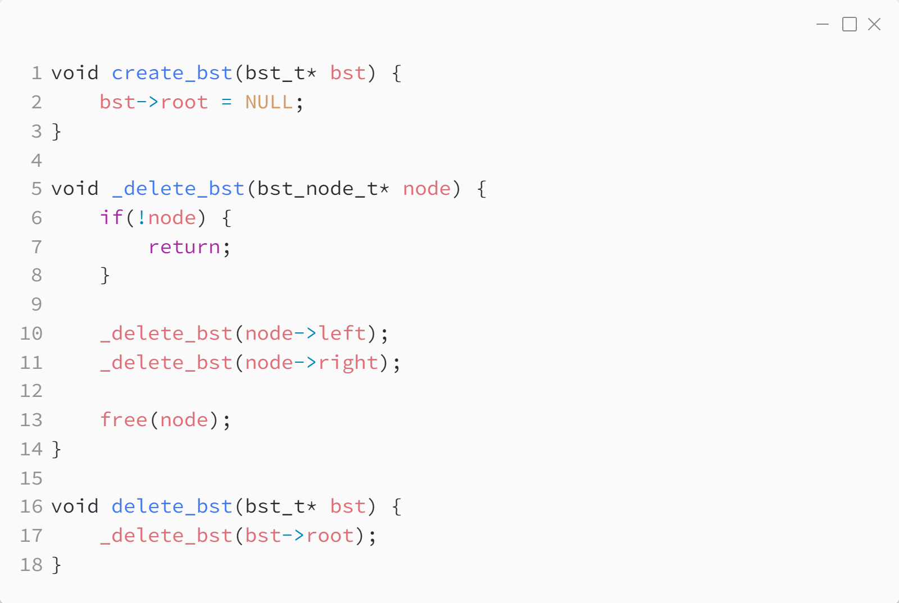
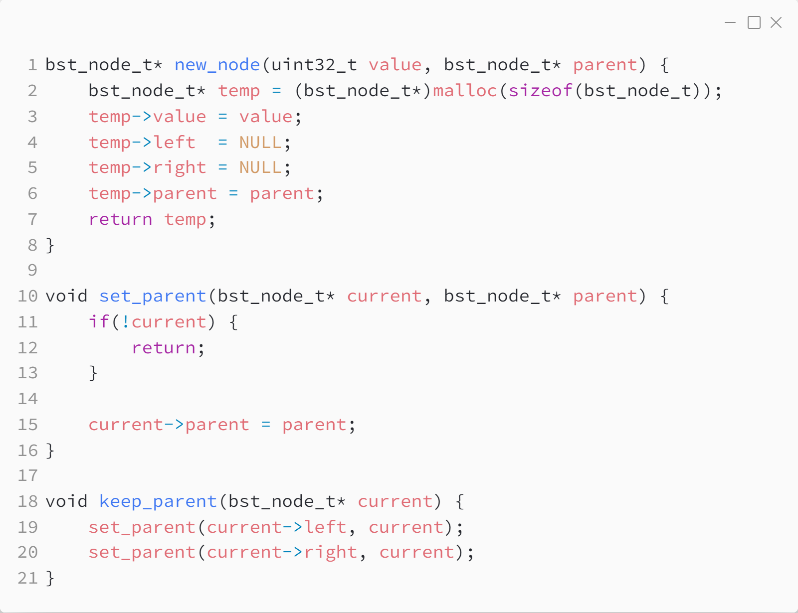

_Практика 9. Splay дерево поиска._

Исходный код - [bst.c](../src/bst_splay.c)

### Структуры данных:

### Создание и удаление дерева:

### Вспомогательные функции:

[plan](../practice.md) | [>](1.md)
